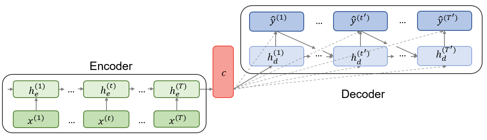
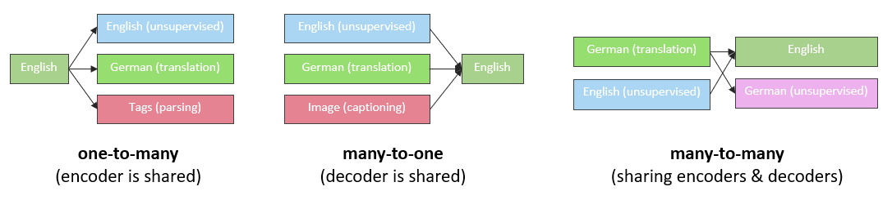

# Recurrent neural networks and their applications in NLP

*Author: Marianna Plesiak*

*Supervisor: Christian Heumann*


## Structure and Training of Simple RNNs

**R**ecurrent **n**eural **n**etworks (**RNNs**) enable to relax the condition of non-cyclical connections in the classical feedforward neural networks which were described in the previous chapter. This means, while simple multilayer perceptrons can only map from input to output vectors, RNNs allow the entire history of previous inputs to influence the network output. [@graves2013generating]

The first part of this chapter provides the structure definition of RNNs, presents the principles of their training and explains problems with backpropagation. The second part covers gated units, an improved way to calculate hidden states. The third part gives an overview of some extended versions of RNNs and their applications in NLP.

### Network Structure and Forwardpropagation

An **unfolded computational graph** can visualize the repetitive structure of RNNs: 

```{r 01-02-unfold, echo=FALSE, message=FALSE, fig.align="center",fig.cap="Unfolded computatinal graph of an RNN. Source: Own figure.", out.width = '100%'}

knitr::include_graphics("figures/01-02-rnns-and-their-applications-in-nlp/1_unfolded_graph.png")
```

Each node is associated with a network layer at a particular time instance. Inputs $x^{(t)}$ must be encoded as numeric vectors, for instance word embeddings or one-hot encoded vectors, see the previous chapter. Recurrently connected vectors $h$ are called **hidden states** and represent the outputs of the hidden layer. At time $t$, a hidden state $h^{(t)}$ combines information from the previous hidden state $h^{(t-1)}$ as well as the new input $x^{(t)}$ and transmits it to the next hidden state. Obviously, such an architecture requires the initialization of $h^{(0)}$ since there is no memory at the very beginning of the sequence processing. Given the hidden sequences, output vectors $\hat{y}^{(t)}$ are used to build the predictive distribution $Pr(x^{(t+1)}|y^{(t)})$ for the next input [@graves2013generating]. Since the predictions are created at each time instance $t$, the total output has a shape $[\#\ time\_steps, \#\ output\_features]$. However, in some cases the whole history of output features is not necessary. For example, in sentiment analysis the last output of the loop is sufficient because it contains the entire information about the sequence. [@chollet2018deep]

The unfolded recurrence can be formalized as following:

$$\begin{align}
h^{(t)} & = g^{(t)}(x^{(t)},x^{(t-1)},...,x^{(2)}, x^{(1)}) \\
& = f(h^{(t-1)},x^{(t)}| \theta)  (\#eq:recurrent)
\end{align}$$

After $t$ steps, the function $g^{(t)}$ takes into account the whole sequence $(x^{(t)},x^{(t-1)},...,x^{(2)}, x^{(1)})$ and produces the hidden state $h^{(t)}$. Because of its cyclical structure, $g^{(t)}$ can be factorized into the repeated application of the same function $f$. This function can be considered to be a universal model with parameters $\theta$ which are shared across all time steps and generalized for all sequence lengths. This concept is called parameter sharing and is illustrated in the unfolded computational graph as a reuse of the same matrices $W_{xh}$, $W_{hh}$ and $W_{hy}$ through the entire network. [@goodfellow2016deep]

Considering a recurrent neural network with one hidden layer that is used to predict words or characters, the output should be discrete and the model maps input sequence to output sequence of the same length. Then, the forward propagation is computed by iterating the following equations:

$$\begin{align}
h^{(t)} & = \mathcal{f}(a+W_{hh}h^{(t-1)}+W_{xh}x^{(t)}) (\#eq:input-to-hidden) \\
y^{(t)} & = \mathcal{s}(b+W_{hy}h^{(t)}) (\#eq:hidden-to-output) 
\end{align}$$

where, according to @graves2013generating, the parameters and functions denote the following:

* $x^{(t)}$, $h^{(t)}$ and $y^{(t)}$: input, hidden state and output at time step $t$ respectively;
* $\mathcal{f}$: activation function of the hidden layer. Usually it is a saturating nonlinear function such as a sigmoid activation function ( @sutskever2014sequence and @mikolov2010recurrent);  
* $W_{hh}$: weight matrix connecting recurrent connections between hidden states;    
* $W_{xh}$: weight matrix connecting inputs to a hidden layer;  
* $W_{hy}$: weight matrix connecting hidden states to outputs;  
* $\mathcal{s}$: output layer function. If the model is used to predict words, the softmax function is usually chosen as it returns valid probabilities over the possible outputs [@mikolov2010recurrent];  
* $a$, $b$: input and output bias vectors.  

Since inputs $x^{(t)}$ are usually encoded as one-hot-vectors, the dimension of a vector representing one word corresponds to the size of vocabulary. The size of a hidden layer must reflect the size of training data. The model training requires initialization of the initial state $h^{(0)}$ as well as the weight matrices, which are usually set to small random values [@mikolov2010recurrent]. Since the model is used to compute the predictive distributions $Pr(x^{(t+1)}|y^{(t)})$ at each time instance $t$, the network distribution is denoted as following:

$$\begin{align}
Pr(x) & =\prod_{t} Pr(x^{(t+1)}|y^{(t)}) (\#eq:rnn-probability) 
\end{align}$$

and the total loss $\mathcal{L(x)}$, which must be minimized during the training, is simply the sum of losses over all time steps denoted as the negative log-likelihood of $Pr(x)$:

$$\begin{align}
\mathcal{L(x)} & =-\sum_{t} \log{Pr(x^{(t+1)}|y^{(t)})} (\#eq:rnn-log-loss)   
\end{align}$$

[@graves2013generating]


### Backpropagation

To train the model, one must calculate the gradients for the three weight matrices $W_{xh}$, $W_{hh}$ and $W_{hy}$. The algorithm differs from a regular backpropagation because a chain rule must be applied recursively, and the gradients are summed up through the network [@boden2002guide]. Using the notation $\mathcal{L^{(t)}}$ as the output at time $t$, one must first estimate single losses at each time step and then sum them up in order to obtain total loss $\mathcal{L(x)}$. 

@chen2016gentle provides a nice guide to backpropagation for a simple RNN in the meaning of equations \@ref(eq:input-to-hidden) and \@ref(eq:hidden-to-output). According to him, the gradient w.r.t. $W_{hy}$ for a single time step $t$ is calculated as follows:

$$\begin{align}
\frac{\partial \mathcal{L^{(t)}}}{\partial W_{hy}} & = \frac{\partial \mathcal{L^{(t)}}}{\partial y^{(t)}} \frac{\partial y^{(t)}}{\partial W_{hy}}(\#eq:rnn-back-hy-one) \\
\end{align}$$

Since $W_{hy}$ is shared across all time sequence, the total loss w.r.t. the weight matrix connecting hidden states to outputs is simply a sum of single losses:

$$\begin{align}
\frac{\partial \mathcal{L}}{\partial W_{hy}} & = \sum_{t} \frac{\partial \mathcal{L^{(t)}}}{\partial y^{(t)}} \frac{\partial y^{(t)}} {\partial W_{hy}}  (\#eq:rnn-back-hy-all) \\    
\end{align}$$

Similarly, derivation of the gradient w.r.t. $W_{hh}$ for a single time step is obtained as follows:

$$\begin{align}
\frac{\partial \mathcal{L^{(t)}}}{\partial W_{hh}} & = \frac{\partial \mathcal{L^{(t)}}}{\partial y^{(t)}} \frac{\partial y^{(t)}}{\partial h^{(t)}} \frac{\partial h^{(t)}}{\partial W_{hh}} (\#eq:rnn-back-hh-one)
\end{align}$$

However, the last part $h^{(t)}$ also depends on $h^{(t-1)}$ and the gradient can be rewritten according to the **B**ack**p**ropagation **T**hrough **Time** algorithm (**BPTT**) starting from $t$ and going back to the initial hidden state at time step $k=0$:

$$\begin{align}
\frac{\partial \mathcal{L^{(t)}}}{\partial W_{hh}}
& = \frac{\partial \mathcal{L^{(t)}}}{\partial y^{(t)}} \frac{\partial y^{(t)}}{\partial h^{(t)}} \frac{\partial h^{(t)}}{\partial h^{(t-1)}} \frac{\partial h^{(t-1)}}{\partial W_{hh}} \\
& = \sum_{k=0}^{t} \frac{\partial \mathcal{L^{(t)}}}{\partial y^{(t)}} \frac{\partial y^{(t)}}{\partial h^{(t)}} \frac{\partial h^{(t)}}{\partial h^{(k)}} \frac{\partial h^{(k)}}{\partial W_{hh}} (\#eq:rnn-back-hh-one-one)
\end{align}$$

Single gradients are again aggregated to yield the overall loss w.r.t $W_{hh}$:

$$\begin{align}
\frac{\partial \mathcal{L}}{\partial W_{hh}}
& = \sum_{t} \sum_{k=0}^{t} \frac{\partial \mathcal{L^{(t)}}}{\partial y^{(t)}} \frac{\partial y^{(t)}}{\partial h^{(t)}} \frac{\partial h^{(t)}}{\partial h^{(k)}} \frac{\partial h^{(k)}}{\partial W_{hh}} (\#eq:rnn-back-hh-all)
\end{align}$$


The derivation of gradients w.r.t. $W_{xh}$ is similar to those w.r.t $W_{hh}$ because both $h^{(t-1)}$ and $x^{(t)}$ contribute to $h^{(t)}$ at time step $t$. The derivative w.r.t. $W_{xh}$ for the whole sequence is then obtained by summing up all contributions from $t$ to $0$ via backpropagation for all time steps:

$$\begin{align}
\frac{\partial \mathcal{L}}{\partial W_{xh}}
& = \sum_{t} \sum_{k=0}^{t} \frac{\partial \mathcal{L^{(t)}}}{\partial y^{(t)}} \frac{\partial y^{(t)}}{\partial h^{(t)}} \frac{\partial h^{(t)}}{\partial h^{(k)}} \frac{\partial h^{(k)}}{\partial W_{xh}} (\#eq:rnn-back-xh-all)
\end{align}$$

The derivatives w.r.t. the bias vectors $a$ and $b$ are calculated based on the same principles and thus are not shown here explicitly. 


### Vanishing and Exploding Gradients

In order to better understand the mathematical challenges of BPTT, one should consider equation \@ref(eq:rnn-back-hh-one-one), and in particular the factor $\frac{\partial h^{(t)}}{\partial h^{(k)}}$. @pascanu2013difficulty go into detail and show that it is a chain rule in itself and can be rewritten as a product $\frac{\partial h^{(t)}}{\partial h^{(t-1)}} \frac{\partial h^{(t-1)}}{\partial h^{(t-2)}} \ldots \frac{\partial h^{(2)}}{\partial h^{(1)}}$. Since one computes the derivative of a vector w.r.t another vector, the result will be a product of $t-k$ Jacobian matrices whose elements are the pointwise derivatives:

$$\begin{align}
\frac{\partial h^{(t)}}{\partial h^{(k)}}
& = \prod_{t\geq\ i>k}^{} \frac{\partial h^{(i)}}{\partial h^{(i-1)}}
= \prod_{t\geq\ i>k}^{} W_{hh}^{T}diag(\mathcal{f}^{'}(h^{(i-1)}))  (\#eq:rnn-back-vanishing) 
\end{align}$$

Thus, with small values in $W_{hh}$ and many matrix multiplications the norm of the gradient shrinks to zero exponentially fast with $t-k$ which results in a vanishing gradient problem and the loss of long term contributions. Exploding gradients refer to the opposite behaviour when the norm of the gradient increases largely and leads to a crash of the model. @pascanu2013difficulty give an overview of techniques for dealing with the exploding and vanishing gradients. Among other solutions they mention proper initialisation of weight matrices, sampling $W_{hh}$ and $W_{xh}$ instead of learning them, rescaling or clipping the gradient's components (putting a maximum limit on it) or using L1 or L2 penalties on the recurrent weights. Even more popular models are gated RNNs which explicitly address the vanishing gradients problem and will be explained in the next subchapter.

## Gated RNNs

Main feature of gated RNNs is the ability to store long-term memory for a long time and at the same time to account for new inputs as effectively as possible. In modern NLP, two types of gated RNNs are used widely: Long Short-Term Memory networks and Gated Recurrent Units.

### LSTM

**L**ong **S**hort-**T**erm **Memory** (**LSTM**) networks were introduced by @hochreiter1997long with the purpose of dealing with problems of long term dependencies. Figure \@ref(fig:01-02-lstm-gru) illustrates the complex architecture of LSTM hidden state. Instead of a simple hidden unit that combines inputs and previous hidden states linearly and outputs their nonlinear transformation to the next step, hidden units are now extended by special input, forget and output gates that help to control the flow of information. Such more complex units are called memory cells, and the following equations show how a LSTM uses the gating mechanism to calculate the hidden state within a memory cell: 

$$\begin{align}
f^{(t)} & = sigm(W_{xf}x^{(t)}+W_{hf}h^{(t-1)}+b_{f}) (\#eq:lstm-forget) \\
i^{(t)} & = sigm(W_{xi}x^{(t)}+W_{hi}h^{(t-1)}+b_{i}) (\#eq:lstm-input) \\
o^{(t)} & = sigm(W_{xo}x^{(t)}+W_{ho}h^{(t-1)}+b_{o}) (\#eq:lstm-output) \\
g^{(t)} & = tanh(W_{xc}x^{(t)}+W_{hc}h^{(t-1)}+b_{c}) (\#eq:lstm-candidates) \\
c^{(t)} & = f^{(t)}c^{(t-1)}+i^{(t)}g^{(t)} (\#eq:lstm-newcell) \\
h^{(t)} & = o^{(t)}tanh(c^{(t)}) (\#eq:lstm-newoutput) \\
\end{align}$$

First, the forget gate $f^{(t)}$ decides which values of the previous output $h^{(t-1)}$ to forget. The next step involves deciding which information will be stored in the internal cell state $c^{(t)}$. This step consists of the following two parts: 1) the old cell state $c^{(t-1)}$ is multiplied by $f^{(t)}$ in order to forget information; 2) new candidates are calculated in $g^{(t)}$ and multiplied by the input gate $i^{(t)}$ in order to add new information. Finally, the output $h^{(t)}$ is produced with help of the output gate $o^{(t)}$ and applying a $tanh$ function to the cell state in order to only output selected values. (@goodfellow2016deep, @graves2013generating)


### GRU

In 2014, @cho2014learning introduced **G**ated **R**ecurrent **U**nits (**GRU**) whose structure is simpler than that of LSTM because they have only two gates, namely reset and update gate.
The hidden state is thus calculated as follows:

$$\begin{align}
r^{(t)} & = sigm(W_{xr}x^{(t)}+W_{hr}h^{(t-1)}) (\#eq:gru-reset) \\
\tilde{h}^{(t)} & = tanh(W_{xh}x^{(t)}+W_{hh}(r^{(t)} \odot h^{(t-1)})) (\#eq:gru-hidden) \\
z^{(t)} & = sigm(W_{xz}x^{(t)}+W_{hz}h^{(t-1)}) (\#eq:gru-update) \\
h^{(t)} & = z^{(t)}\odot h^{(t-1)}+(1-z^{(t)})\odot \tilde{h}^{(t)} (\#eq:gru-hidden-output) \\
\end{align}$$

First, the reset gate $r^{(t)}$ decides how much the previous hidden state $h^{(t-1)}$ is ignored, so if $r^{(t)}$ is close to $0$, the hidden state is forced to drop past irrelevant information and reset with current input $x^{(t)}$. A candidate hidden state $\tilde{h}^{(t)}$ is then obtained in the following three steps: 1) weight matrix $W_{xh}$ is multiplied by current input $x^{(t)}$; 2) weight matrix $W_{hh}$ is multiplied by the element-wise product (denoted as $\odot$) of reset gate $r^{(t)}$ and previous hidden state $h^{(t)}$; 3) both products are added and a $tanh$ function is applied in order to output the candidate values for a hidden state. 
On the other hand, the update gate $z^{(t)}$ decides how much of the previous information stored in $h^{(t-1)}$ will carry over to $h^{(t)}$ and how much the new hidden state must be updated with the candidate $\tilde{h}^{(t)}$. Thus, the update gate combines the functionality of LSTM forget and input gates and helps to capture long-term memory. @cho2014learning used the GRU in the machine translation task and showed that the novel hidden units can achieve good results in term of BLEU score (see chapter [11](./resources-and-benchmarks-for-nlp.html) for definition) while being computationally cheaper than LSTM. 

Figure \@ref(fig:01-02-lstm-gru) visualizes the architecture of hidden states of gated RNNs mentioned above and illustrates their differences:

```{r 01-02-lstm-gru, echo=FALSE, message=FALSE, fig.align="center",fig.cap="Structure of a hidden unit. LSTM on the right and GRU on the left. Source: Own figure inspired by http://colah.github.io/posts/2015-08-Understanding-LSTMs/", out.width = '100%'}

knitr::include_graphics("figures/01-02-rnns-and-their-applications-in-nlp/2_lstm_vs_gru.png")
```

## Extensions of Simple RNNs

In most challenging NLP tasks, such as machine translation or text generation, one-layer RNNs even with gated hidden states cannot often deliver successful results. Therefore more complicated architectures are necessary. Deep RNNs with several hidden layers may improve model performance significantly. On the other hand, completely new designs such as Encoder-Decoder architectures are most effective when it comes to mapping sequences of an arbitrary length to a sequence of another arbitrary length.

### Deep RNNs

The figure \@ref(fig:01-02-unfold) shows that each layer is associated with one parameter matrix so that the model is considered shallow. This structure can be extended to a deep RNN, although the depth of an RNN is not a trivial concept since its units are already expressed as a nonlinear function of multiple previous units. 

#### Stacked RNNs  

In their paper @graves2013speech use a deep RNN for speech recognition where the depth is defined as stacking $N$ hidden layers on top of each other with $N>1$. In this case the hidden vectors are computed iteratively for all hidden layers $n=1$ to $N$ and for all time instances $t=1$ to $T$:

$$\begin{align}
h_{n}^{(t)} & = \mathcal{f}(a_{n}+W_{h_{n}h_{n}}h_{n}^{(t-1)}+W_{h_{n-1}h_{n}}h_{n-1}^{(t)}) (\#eq:deep-hidden)
\end{align}$$

As a hidden layer function @graves2013speech choose **bidirectional LSTM**. Compared to regular LSTM, BiLSTM can train on inputs in their original as well as reversed order. The idea is to stack two separate hidden layers one on another while one of the layers is responsible for the forward information flow and another one for the backward information flow. Especially in speech recognition one must take in consideration future context, too, because pronouncement depends both on previous and next phonemes. Thus, BiLSTMs are able to access long-time dependencies in both input directions. Finally, @graves2013speech compare different deep BiLSTM models (from 1 to 5 hidden layers) with unidirectional LSTMs and a pre-trained RNN transducer (BiLSTM with 3 hidden layers pretrained to predict each phoneme given the previous ones) and show clear advantage of deep networks over shallow designs. 

#### Deep Transition RNNs 

@pascanu2013construct proposed another way to make an RNN deeper by introducing **transitions**, one or more intermediate nonlinear layers between input to hidden, hidden to output or two consecutive hidden states. They argue that extending input-to-hidden functions helps to better capture temporal structure between successive inputs. A deeper hidden-to-output function, DO-RNN, can make hidden states more compact and therefore enables the model to summarize the previous inputs more efficiently. A deep hidden-to-hidden composition, DT-RNN, allows for the hidden states to effectively add new information to the accumulated summaries from the previous steps. They note though, because of including deep transitions, the distances between two variables at $t$ and $t+1$ become longer and the problem of loosing long-time dependencies may occur. One can add shortcut connections to provide shorter paths for gradients, such networks are referred to as DT(S)-RNNs. If deep transitions with shortcuts are implemented both in hidden and output layers, the resulting model is called DOT(S)-RNNs. @pascanu2013construct evaluate these designs on the tasks of polyphonic music prediction and character- or word-level language modelling. Their results reveal that deep transition RNNs clearly outperform shallow RNNs in terms of perplexity (see chapter [11](./resources-and-benchmarks-for-nlp.html) for definition) and negative log-likelihood.

### Encoder-Decoder Architecture

#### Design and Training

The problem of mapping variable-length input sequences to variable-length output sequences is known as Sequence-to-Sequence or **seq2seq** learning in NLP. Although originally applied in machine translation tasks (@sutskever2014sequence, @cho2014learning), the seq2seq approach achieved state-of-the-art results also in speech recognition [@prabhavalkar2017comparison] and video captioning [@venugopalan2015sequence]. According to @cho2014learning, the seq2seq model is composed of two parts as illustrated below:

```{r 01-02-enc-dec, echo=FALSE, message=FALSE, fig.align="center",fig.cap="Encoder-Decoder architecture. Source: Own figure based on @cho2014learning.", out.width = '100%'}


```

The first part is an **encoder**, an RNN which is trained on input sequences in order to obtain a large summary vector $c$ with a fixed dimension. This vector is called context and is usually a simple function of the last hidden state. @sutskever2014sequence used the final encoder hidden state as context such that $c=h_{e}^{(T)}$. The second part of the model is a **decoder**, another RNN which generates predictions given the context $c$ and all the previous outputs. In contrast to a simple RNN described at the beginning of this chapter, decoder hidden states $h_{d}^{(t)}$ are now conditioned on the previous outputs $y^{(t)}$, previous hidden states $h_{d}^{(t)}$ and the summary vector $c$ from the encoder part. Therefore, the conditional distribution of the one-step prediction is obtained by:

$$\begin{align}
h_{d}^{(t)} & = f(h_{d}^{(t-1)},y^{(t-1)},c) (\#eq:decoder-hidden) \\
P(y^{(t)}|y^{(t-1)},...y^{(1)},c) & = \mathcal{s}(h_{d}^{(t)},y^{(t-1)},c) (\#eq:decoder-output) \\
\end{align}$$

Both parts are trained simultaneously to maximize the conditional log-likelihood $\frac{1}{N}\sum_{n=1}^{N}\log{p_{\theta}(y_{n}|x_{n})}$, where $\theta$ denotes the set of model parameters and $(y_{n},x_{n})$ is an (input sequence, output sequence) pair from the training set with size $N$ (@cho2014learning).

#### Multi-task seq2seq Learning

@luong2015multi extended the idea of encoder-decoder architecture even further by allowing **multi-task learning** (**MLT**) for seq2seq models. MLT aims to improve performance of one task using other related tasks such that one task complements another. In their paper, they investigate the following three settings: a) *one-to-many* - where the encoder is shared between different tasks such as translation and syntactic parsing, b) *many-to-one* - where the encoders learn different tasks such as translation and image captioning and the decoder is shared, c) *many-to-many* - where the model consists of multiple encoders and decoders which is the case of autoencoders, an unsupervised task used to learn a representation of monolingual data.

```{r 01-02-multi-task-seq2seq, echo=FALSE, message=FALSE, fig.align="center",fig.cap="Multi-task settings. Source: @luong2015multi.", out.width = '100%'}


```

@luong2015multi consider German-to-English and English-to-German translations as the primary task and try to determine whether other tasks can improve their performance and vice versa. After training deep LSTM models with four layers for different task combinations, they conclude that MLT can improve the performance of seq2seq models substantially. For instance, the translation quality improves after adding a small number of parsing minibatches (one-to-many setting) or after the model have been trained to generate image captions (many-to-one setting). In turn, translation task helps to parse large data corpus much better (one-to-many setting). In contrast to these achievements, autoencoder task does not show significant improvements in translation after two unsupervised learning tasks on English and German language data.

## Conclusion

RNNs are powerful models for sequential data. Even in their simple form they can show valid results in different NLP tasks but their shortcomings led to introduction of more flexible networks such as gated units and encoder-decoder designs described in this chapter. As NLP has become a highly discussed topic in the recent years, even more advanced concepts such as Transfer Learning and Attention have been introduced, which still base on an RNN or its extension. However, RNNs are not the only type of neural networks used in NLP. Convolutional neural networks also find their application in modern NLP, and the next chapter will describe them.

