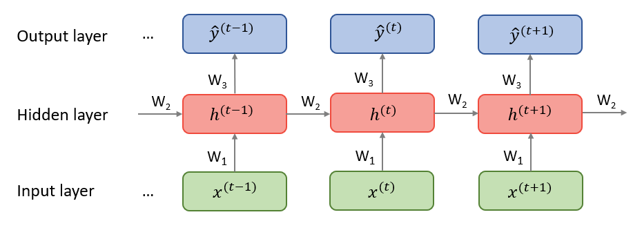
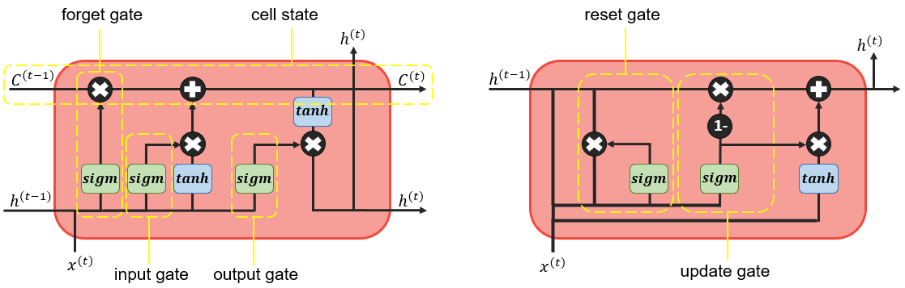
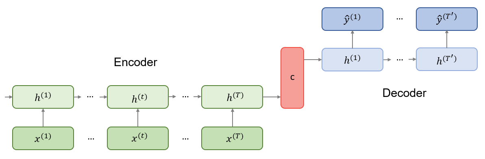

# Recurrent neural networks and their applications in NLP

*Author: Marianna Plesiak*

*Supervisor: Christian Heumann*


## Structure and Training of Simple RNNs

Recurrent neural networks allow to relax the  condition of non-cyclical connections in the classical feedforward neural networks which were described in the previous chapter. This means, while simple multilayer perceptrons can only map from input to output vectors, RNNs allow the entire history of previous inputs to influence the network output. (@ Graves 2012)
The first part of this chapter provides the structure definition of RNNs, presents the principles of their training and explains problems with backpropagation. In the second part, gated units, an improved way to calculate hidden states, are explained. The third part gives an overview of some extended versions of RNNs and their applications in NLP.

### Network Structure and Forwardpropagation

The repetitive structure of RNNs can be visualised with help of an unfolded computational graph(see @ figure 1). 

```{r echo=FALSE, message=FALSE, fig.align="center",fig.cap="Unfolded computatinal graph of a RNN. Source: Own figure.", out.width = '100%'}


```

Each node is associated with a network layer at a particular time instance. Inputs $x^{(t)}$ must be encoded as numeric vectors, for instance word embeddings or one-hot encoded vectors, see previous chapter. Reccurently connected vectors $h$ are called hidden states and represent the outputs of the hidden layers. At time $t$, a hidden state $h^{(t)}$ combines information from the previous hidden state $h^{(t-1)}$ as well as the new input $x^{(t)}$ and passes it through to the next hidden layer. Obviously, such an architecture requires the initialization of $h^{(0)}$ since there is no memory at the very beginning of the sequence processing. Given the hidden sequences, output vectors $\hat{y}^{(t)}$ are used to build the predictive distribution $Pr(x^{(t+1)}|y^{(t)})$ for the next input. Since the predictions are created at each time instance $t$, the total output has a shape [time_steps, output_features]. However in some cases this is not needed, for example in sentiment analysis the last output of the loop is sufficient because it contains the entire information about the sequence. (@ Chollet) (@ Graves 2012) 

The unfolded recurrence can be formalized as following:


\begin{align}
h^{(t)} & = g^{(t)}(x^{(t)},x^{(t-1)},...,x^{(2)}, x^{(1)}) \\
& = f(h^{(t-1)},x^{(t)}| \theta)  (\#eq:recurrent)
\end{align}

After $t$ steps, the function $g^{(t)}$ takes into account the whole sequence $(x^{(t)},x^{(t-1)},...,x^{(2)}, x^{(1)})$ and produces the hidden state $h^{(t)}$. Because of its cyclical structure, $g^{(t)}$ can be factorized into the repeated application of a same function $f$. This function can be considered a universal model which is shared across all time steps and is generalized for all sequence lengths. This is called parameter sharing and is illustrated in the unfolded computational graph as a reuse of the same matrices $W_{xh}$, $W_{hh}$ and $W_{hy}$ through the entire network. (@ Goodfellow book)

Consider a recurrent neural network with one hidden layer that is used to predict words or characters, so the output is discrete and the model maps input sequence to output sequence of the same length. Then the forward propagation is computed by iterating the following equations:

\begin{align}
h^{(t)} & = \mathcal{H}(a+W_{hh}h^{(t-1)}+W_{xh}x^{(t)}) (\#eq:input-to-hidden) \\ 
y^{(t)} & = \mathcal{Y}(b+W_{hy}h^{(t)}) (\#eq:hidden-to-output) \\
\end{align}

where the parameters and functions denote the following:

* $\mathcal{H}$: hidden layer function. Usually it is a sigmoid activation function (@ Sutzkever et al 2014 and Mikolov 2010) or tanh or ReLu  
* $W_{hh}$: weight matrix connecting recurrent connections between hidden states    
* $W_{xh}$: weight matrix connecting inputs to hidden layer  
* $W_{hy}$: weight matrix connecting hidden states to outputs (softmax if we want to predict next word or letter)  
* $\mathcal{Y}$: output layer function. If the model is used to predict words, softmax function is usually chosen as it returns valid probabilities over the possible outputs (@) Mikolov 2010)  
* $a$, $b$: input and output bias vectors. (Graves 2014) 

Because inputs $x^{(t)}$ are usually encoded as one-hot-vectors, the dimension of a vector representing one word corresponds to the size of vocabulary (in practice 30000-200000 words according to @ Mikolov 2010). The size of a hidden layer must reflect the size of training data and is often chosen to be between 30 and 500 hidden units (@ Mikolov 2010). The model training requires initialization of the initial state $h^{(0)}$ as well as the weight matrices, which are usually set to small random values (@ Mikolov 2010). Since the network is used to compute the predictive distributions $Pr(x^{(t+1)}|y^{(t)})$ at each time instance $t$, the network distribution is denoted as

\begin{align}
Pr(x) & =\prod_{t} Pr(x^{(t+1)}|y^{(t)}) (\#eq:rnn-probability) \\
\end{align}

and the total loss used for training is simply the sum of the losses over all time steps denoted as the negative log-likelihood of $Pr(x)$:

\begin{align}
\mathcal{L(x)} & =-\sum_{t} \log{Pr(x^{(t+1)}|y^{(t)})} (\#eq:rnn-log-loss) \\  
\end{align}

@ Graves 2014


### Backpropagation 

In order to train the model, one must calculate the gradients for the three weights matrices $W_{xh}$, $W_{hh}$ and $W_{hy}$. The algorithm differs from a regular backpropagation because we have to apply chain rule recursively and sum up the gradients through the network. 

Gradients w.r.t. $W_{hy}$:  

* for a single time step $t$:  

\begin{align}
\frac{\partial \mathcal{L^{(t)}}}{\partial W_{hy}} & = \frac{\partial \mathcal{L^{(t)}}}{\partial y^{(t)}} \frac{\partial y^{(t)}}{\partial W_{hy}}(\#eq:rnn-back-hy-one) \\ 
\end{align}

* for the whole sequence:  

\begin{align}
\frac{\partial \mathcal{L}}{\partial W_{hy}} & = \sum_{t} \frac{\partial \mathcal{L}}{\partial y^{(t)}} \frac{\partial y^{(t)}} {\partial W_{hy}}  (\#eq:rnn-back-hy-all) \\    
\end{align}

Gradients w.r.t. $W_{hh}$:

* for a single time step $t$:

\begin{align}
\frac{\partial \mathcal{L^{(t)}}}{\partial W_{hh}} & = \frac{\partial \mathcal{L^{(t)}}}{\partial y^{(t)}} \frac{\partial y^{(t)}}{\partial h^{(t)}} \frac{\partial h^{(t)}}{\partial W_{hh}} (\#eq:rnn-back-hh-one) 
\end{align}

The last part $h^{(t)}$ also depends on $h^{(t-1)}$ and the gradient can be rewritten as:

\begin{align}
\frac{\partial \mathcal{L^{(t)}}}{\partial W_{hh}}
& = \frac{\partial \mathcal{L^{(t)}}}{\partial y^{(t)}} \frac{\partial y^{(t)}}{\partial h^{(t)}} \frac{\partial h^{(t)}}{\partial h^{(t-1)}} \frac{\partial h^{(t-1)}}{\partial W_{hh}} \\
& = \sum_{k=0}^{t} \frac{\partial \mathcal{L^{(t)}}}{\partial y^{(t)}} \frac{\partial y^{(t)}}{\partial h^{(t)}} \frac{\partial h^{(t)}}{\partial h^{(k)}} \frac{\partial h^{(k)}}{\partial W_{hh}} (\#eq:rnn-back-hh-one-one) 
\end{align}


* for the whole sequence:

\begin{align}
\frac{\partial \mathcal{L}}{\partial W_{hh}}
& = \sum_{t} \sum_{k=0}^{t} \frac{\partial \mathcal{L^{(t)}}}{\partial y^{(t)}} \frac{\partial y^{(t)}}{\partial h^{(t)}} \frac{\partial h^{(t)}}{\partial h^{(k)}} \frac{\partial h^{(k)}}{\partial W_{hh}} (\#eq:rnn-back-hh-all) 
\end{align}


Gradient w.r.t. $W_{xh}$ is similar to $W_{hh}$:

* for a single step:

\begin{align}
\frac{\partial \mathcal{L^{(t)}}}{\partial W_{xh}}
& = \frac{\partial \mathcal{L^{(t)}}}{\partial y^{(t)}} \frac{\partial y^{(t)}}{\partial h^{(t)}} \frac{\partial h^{(t)}}{\partial W_{xh}} \\
& = \frac{\partial \mathcal{L^{(t)}}}{\partial y^{(t)}} \frac{\partial y^{(t)}}{\partial h^{(t)}} \frac{\partial h^{(t)}}{\partial W_{xh}} + \frac{\partial \mathcal{L^{(t)}}}{\partial y^{(t)}} \frac{\partial y^{(t)}}{\partial h^{(t)}} \frac{\partial  h^{(t)}}{\partial h^{(t-1)}} \frac{\partial h^{(t-1)}}{\partial W_{xh}} \\
& = \sum_{k=0}^{t} \frac{\partial \mathcal{L^{(t)}}}{\partial y^{(t)}} \frac{\partial y^{(t)}}{\partial h^{(t)}} \frac{\partial h^{(t)}}{\partial h^{(k)}} \frac{\partial h^{(k)}}{\partial W_{xh}} (\#eq:rnn-back-xh-one) 
\end{align}

* for the whole sequence:

\begin{align}
\frac{\partial \mathcal{L}}{\partial W_{xh}}
& = \sum_{t} \sum_{k=0}^{t} \frac{\partial \mathcal{L^{(t)}}}{\partial y^{(t)}} \frac{\partial y^{(t)}}{\partial h^{(t)}} \frac{\partial h^{(t)}}{\partial h^{(k)}} \frac{\partial h^{(k)}}{\partial W_{xh}} (\#eq:rnn-back-xh-all) 
\end{align}


### Vanishing and Exploding Gradients


 

## Gated RNNs

### LSTM

Long Short Term Memory networks were introduced by @ Hochreiter Schmidhuber to deal with problems of long term dependencies. Instead of a simple hidden unit that combines inputs and previous hidden states linearly and outputs the non-linear transformation to the next step, hidden units are now extended by special input, forget and output gates which help to control the flow of information. Such more complex units are called memory cells and the following equations show how a LSTM uses the gating mechanism to calculate the hidden state within a memory cell: @ Hochreiter Schmidhuber

\begin{align}
f^{(t)} & = sigm(W_{xf}x^{(t)}+W_{hf}h^{(t-1)}+b_{f}) (\#eq:lstm-forget) \\
i^{(t)} & = sigm(W_{xi}x^{(t)}+W_{hi}h^{(t-1)}+b_{i}) (\#eq:lstm-input) \\
o^{(t)} & = sigm(W_{xo}x^{(t)}+W_{ho}h^{(t-1)}+b_{o}) (\#eq:lstm-output) \\
g^{(t)} & = tanh(W_{xc}x^{(t)}+W_{hc}h^{(t-1)}+b_{c}) (\#eq:lstm-candidates) \\
c^{(t)} & = f^{(t)}c^{(t-1)}+i^{(t)}g^{(t)} (\#eq:lstm-newcell) \\
h^{(t)} & = o^{(t)}tanh(c^{(t)}) (\#eq:lstm-newoutput) \\
\end{align}

First, forget gate $f^{(t)}$ decides which values of the previous output $h^{(t-1)}$ to forget. The next step is deciding which information will be stored in the internal cell state $c^{(t)}$. This step consists of two parts: 1) multiplication of the old state $c^{(t-1)}$ by $f^{(t)}$ (forgetting information); 2) adding new candidates calculated in $g^{(t)}$ with help of its multiplication by values from the input gate $i^{(t)}$ (adding new information). The output $h^{(t)}$ is produced with help of the output gate $o^{(t)}$ and applying a $tanh$ function to the cell state in order to only output values which were chosen. @ Goodfellow 2014, @ Graves 2014


### GRU

Invented by Cho et al. 2014.
Is simpler because it includes only two gates: reset and update

The hidden unit is calculated as:

\begin{align}
r^{(t)} & = sigm(W_{xr}x^{(t)}+W_{hr}h^{(t-1)}) (\#eq:gru-reset) \\
z^{(t)} & = sigm(W_{xz}x^{(t)}+W_{hz}h^{(t-1)}) (\#eq:gru-update) \\
\tilde{h}^{(t)} & = tanh(W_{xh}x^{(t)}+W_{hh}(r^{(t)}h^{(t-1)})) (\#eq:gru-hidden) \\
h^{(t)} & = z_jh_j^{(t-1)}+(1-z_j)\tilde{h}^{(t)} (\#eq:gru-hidden-output) \\
\end{align}


Illustration LSTM vs GRU

```{r echo=FALSE, message=FALSE, fig.align="center",fig.cap="Structure of a hidden unit. Right: LSTM. Left: GRU. Source: Own figure inspired by http://colah.github.io/posts/2015-08-Understanding-LSTMs/", out.width = '100%'}


```

## Extentions of Simple RNNs

### Deep RNNs

### Encoder-Decoder Architecture

The problem of mapping variable-length input sequences to variable-length output sequences is known as Sequence-to-Sequence or seq2seq learning in NLP. Although originally applied in machine translation tasks (@ Sutskever 2014, @ Cho et al 2014), the seq2seq approach achieved state-of-the-art results also in speech recognition (@ Prabhavalkar) and video captioning (@ Venugopalan). According to @ Cho et al 2014, the seq2seq model consists of two parts as illustrated below:

```{r echo=FALSE, message=FALSE, fig.align="center",fig.cap="Encoder-Decoder architecture. Source: Own figure.", out.width = '100%'}


```

The first part is the encoder, a RNN which is trained on input sequences in order to obtain a large summary vector $c$ with a fixed dimension. The second part is a decoder, another RNN which generates predictions. In contrast to a simple RNN described at the beginning of this chapter, outputs $y^{(t)}$ and decoder hidden states $h^{(t)}$ are both conditioned on the summary vector $c$ from the encoder part as well as on $y^{(t-1)}$ and are computed by:

\begin{align}
h^{(t)} & = f(h^{(t-1)},y^{(t-1)},c) (\#eq:decoder-hidden) \\
P(y^{(t)}|y^{(t-1)},...y^{(1)},c) & = \mathcal{Y}(h^{(t-1)},y^{(t-1)},c) (\#eq:decoder-output) \\
\end{align}

Such a structure 

### Bidirectional RNNs


