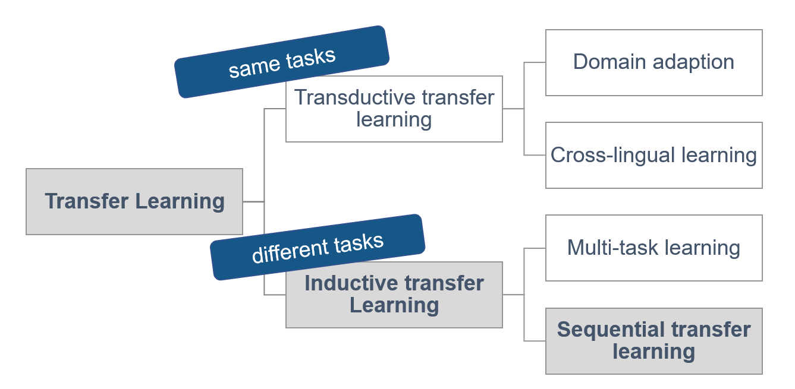
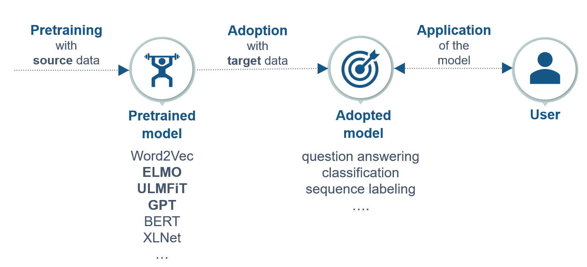
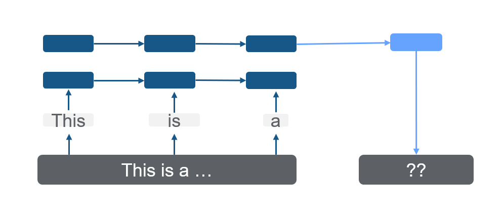
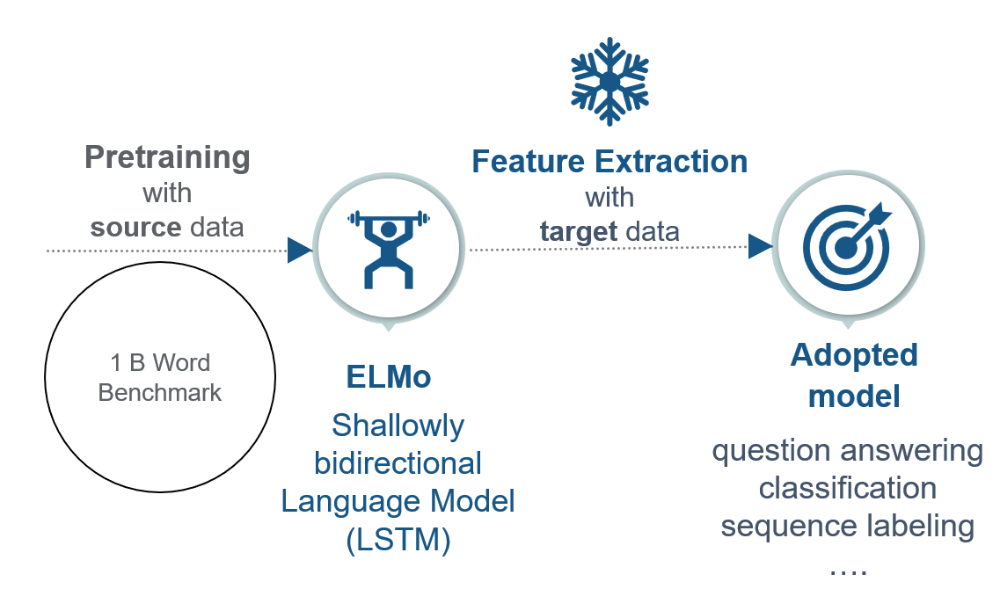
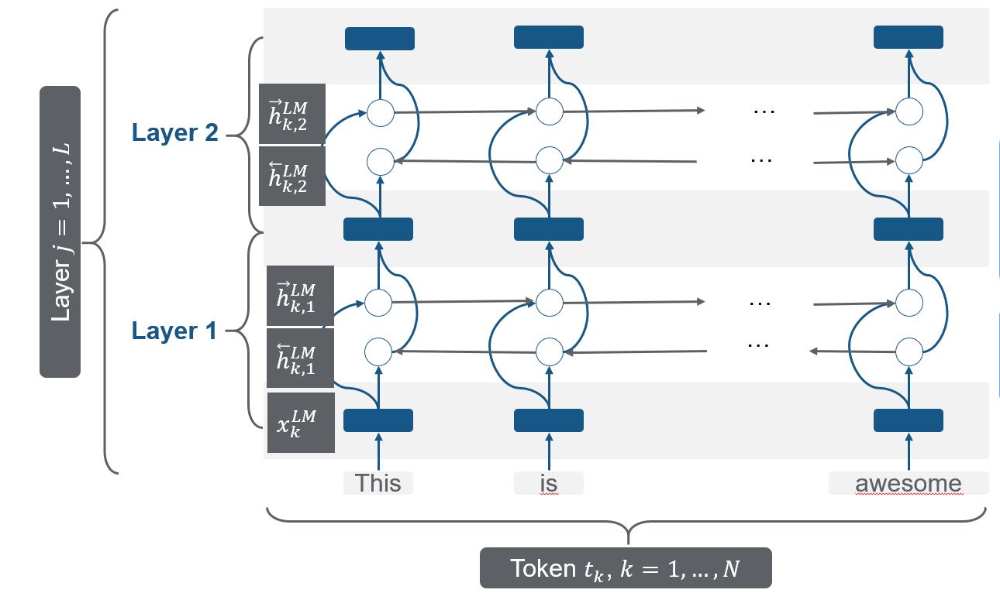
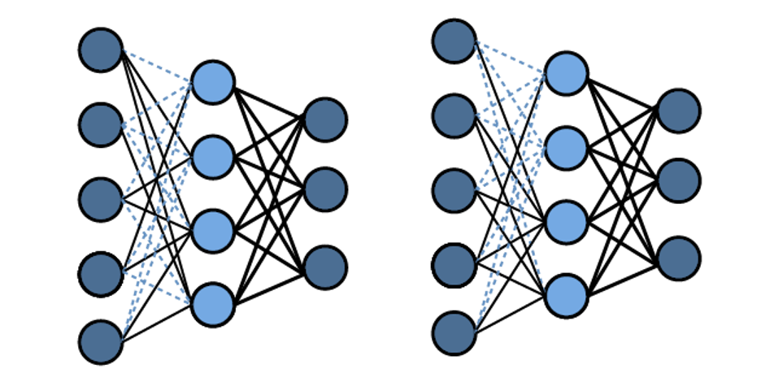

# Transfer Learning for NLP I

*Author: Carolin Becker*

*Supervisor: Matthias Aßenmacher*

## Introduction 

The field of natural language processing (NLP) has seen rapid advancements in recent years. Primarily due to the growing usage of transfer learning where the model has not to be trained from scratch for every task and domain. 

The first "wave" of transfer learning where the trained models 

  * **ELMo** (Embeddings from Language Models), 
  * **ULMFiT** (Universal Language Model Fine-tuning for Text Classification), and 
  * **GPT** (Generative Pre-Training) 
were published.  

These models improved the performance and introduced ideas like contextual embeddings, fine-tuning, and transformers in the field of natural language processing. 


## Outline 


First, the **taxonomy of transfer learning** is introduced. Especially, **inductive sequential transfer learning** will give a framework for the following models, as most models are this type. The difference between embeddings and fine-tuning will be elucidated.

Second, the models are introduced in detail within the framework of the two steps of inductive sequential transfer learning: 


  * The Allen Institute introduced with ELMo a state-of-the-art model that can distinguish between the varying meaning of the same word in different contexts (**contextual word embedding**). 
  
  * Howard and Ruder introduced ULMFiT, an adaption of **fine-tuning** in the context of NLP.
  
  * Open AI published GPT, which is the first **transformer model**, which is an urge for the upcoming chapters. This model architecture is mainly used in the most recent developments. 


Lastly, essential facts are **summarized**, and the **following chapters are motivated**. 


<!-- The field of natural language processing (NLP) has seen rapid advancements in the recent years. Especially, due to the growing usage of transfer learning.  -->


<!-- A first enhancement "wave" began in 2018, where the transfer learning improved several fields in NLP, as the model layers have not to be trained from scratch for every . Also, Word2Vec, which was explained earlier ([chapter??]), is one example of transfer learning. -->

<!-- Scientific papers and research introduced many ideas like contextual word embedding or fine-tuning. In the language modeling these changes led to a better performance in terms of errors and time.  -->

<!-- %### Language Model [Wird das schon bei word2vec erklärt?] -->

<!-- %As [Malte et al. (2019)] wrote, the main improvements were succeeded in the field of the language models. The task of a language model (LM) is to predict which word will follow if the model has the previous words.  -->

## Sequential inductive transfer learning

To get a better understanding of the models introduced in this chapter, the taxonomy is introduced. 

### Types of transfer learning

@panandyoung2010 divided **transfer learning** in different types: 

```{r ch21-typesoftransferlearning, echo=FALSE, out.width="75%", fig.cap="Four types of transfer learning (Source: based on @Ruder2019)", fig.align="center"}

```

On the one hand, in **transductive transfer learning** the source and target task are the same. Within transductive transfer learning there is another distinction between **domain adoption** (data from different domains) and **cross-lingual-learning** (data from different languages). [@Ruder2019]

On the other hand, there is **inductive transfer learning** where the source and the target task is different. Inductive transfer learning can be divided into multi-task transfer learning and sequential transfer learning. In **multi-task** transfer learning several task are learned at the same time and common knowledge is shared between the tasks. In **sequential transfer learning** the general knowledge from the source data is transferred to only one task. [@Ruder2019]

Inductive sequential transfer learning has led to the most significant improvements in the past. Therefore, the following models can be explained in the framework of inductive sequential transfer learning. 

### Sequential inductive transfer learning 

Sequential inductive transfer learning mainly consists of two steps: the pre-training and adoption.

```{r ch21-figure01, echo=FALSE, fig.width = 5, fig.cap="Steps in sequential inductive transfer learning (Source: based on @ruder2019transfer)", fig.align="center"}

```

First the model is pretrained with the source task and second the model is adapted to the target task. This adopted model can be used by the user for the designated task. [@ruder2019transfer] These two steps will be further explained in the following subchapters. 

In the first step, all models are **pretrained** on an extensive source data set, which is, in the best case, very close to the target task ([Peter et al.,  2019]). The pre-trained language models in this chapter are uni-directional models that predict the next word.

```{r ch21-figure07, echo=FALSE, out.width="80%", fig.cap="(ref:ch21-figure7)", fig.align="center"}

```

In a second step, follows the **adoption** on the target task. Here, the main distinction is, if the pre-trained model architecture is kept (**embedding** or **feature extraction**) or the pre-trained model is adjusted to the target task (**fine-tuning**). [SOURCE??]

In **feature extraction**, single parts, which can be sentences or characters, are extracted to a fixed-length matrix with the dimensions $\mathbb{R}^{n} \times k$ where $k$ is the fixed-length. This matrix represents the context of every word given of every other word. So in the adoption phase, the weights in the LM do not change, and just the top layer of the model is used. The adopted model learns a linear combination of the top layer. 

On the other side, **fine-tuning** trains the weights of the pre-trained model on a specific task, which makes it much more flexible and needs no specific adjustment. The disadvantage of this method is that the general knowledge and relationship between words can get lost in the adjustment phase. The term for that is the "catastrophic forgetting" (McCloskey & Cohen, 1989; French, 1999). Techniques for preventing this are freezing, learning rates, and regularization which will be mainly explained in the ULMFiT chapter **[???]**.

<!-- [explaining freezing learning rates and regularization  xxxxxxx] -->

## Models

In the following sections, the models **ELMo** [@peter2018], **ULMFiT**  [@howardruder2018], and **GPT** [@radford2018] are presented, which have shaped the "first wave" of transfer learning before transformers like BERT have been developed and have become popular. All models were presented in 2018 and are built in the framework of inductive sequential transfer learning. 

### ELMo - The "new age" of embeddings

In 2018, @peter2018 from AllenNLP introduced **Embeddings from Language Models** (ELMo), which most significant advance compared to previous models like word2vec and Glove **(chapter??)** is that ELMo can handle the different meanings of a word in different contexts (polysemy). 

For instance, is the meaning of the word "mouse" in the context of computers, a device with which you can control the cursor of your PC. Instead, in the context of animals, it means the small animal. Until ELMo, this could not be captured by an NLP model. For this purpose, ELMo can model the semantical and the synthetical characteristics of a word (like word2vec) but also the varying meanings in different contexts. 

In the context of sequential transfer learning, ELMo can be divided in the steps of pretraining and adoption:

```{r ch21-figure08, echo=FALSE, out.width="60%", fig.cap="ELMo", fig.align="center"}

```

ELMo is pretrained on the 1 Billion Word Benchmark, which is a standard dataset for language modeling from Google. The model architecture of Elmo is a shallowly bidirectional Language model, which will be explained in the further sections. 
Afterwards, the pre-trained model is frozen. That means that all learning rates are set to 0, and an additional layer is added. In the adoption phase, a task-specific representation of the internal representation of the pre-trained model is learned.

#### Pretraining: Bidirectional language model (biLM)

ELMo is based on a two-layer bidirectional LSTM which is the shallow concatenation of independently trained left-to-right and right-to-left multi-layer LSTMs. Bidirectional is, in this case, misleading, as the two steps happen independently from each other:

```{r ch21-elmo-pretrained1, echo=FALSE, out.width="90%", fig.cap="Bidirectional LSTM as pretrained model (Source: based on @peter2018 and @lstmpicture", fig.align="center"}
knitr::include_graphics("figures/02-01-transfer-learning-for-nlp-1/elmo-pretrained-bilm.png")
```

As shown in figure \@ref(fig:ch21-elmo-pretrained1), $N$ tokens are taken into the model. Every token $t_k$ has a context-independent character-based representation called $x_k^{LM}$. Following, the first token would be $x_1^{LM}$, and the last one would be $x_N^{LM}$. By either token embedding or a CNN over characters these representations arecomputed. These are the first representations of the words in the model. 


Additionally to the character-based token representation, there are per layer and token two additional representations; one from the forward language model and one from the backward language model.

A forward language model calculates the probability of a sequential token $t_{k}$ at the position $k$ with the provided history (previous tokens) $t_{1}, \ldots, t_{k-1}$ with: 

$$
\begin{aligned}
p\left(t_{1}, t_{2}, \ldots, t_{N}\right)=\prod_{k=1}^{N} p\left(t_{k} | t_{1}, t_{2}, \ldots, t_{k-1}\right)
\end{aligned}
$$
The backward LM can be defined accordingly to the forward LM. It takes not the previous tokens, but the upcoming tokens into account to calculate the joint distributions of the tokens. 

$$
\begin{aligned}
p\left(t_{1}, t_{2}, \ldots, t_{N}\right)=\prod_{k=1}^{N} p\left(t_{k} | t_{k+1}, t_{k+2}, \ldots, t_{N}\right)
\end{aligned}
$$

These context-dependent representation are notated as $\overrightarrow{\mathbf{h}}_{k, j}^{L M}$ in the forward LSTM and as  $\overleftarrow{\mathbf{h}}_{k, j}^{L M}$ in the backward direction. 

@peter2018 have chosen a two layer bidirectional LSTM which is shown in the figure \@ref(fig:ch21-elmo-pretrained2). As with every layer two additional context-dependent representations are added, A two-layer bidirectional model has five representations per token ($2L+1$).

```{r ch21-elmo-pretrained2, out.width="90%", fig.cap="Bidirectional LSTM as pretrained model (Source: based on @peter2018", fig.align="center"}

```

In the forward direction, a next token $t_{k+1}$ can predict the top layer  $\overrightarrow{\mathbf{h}}_{k, L}^{L M}$ with a Softmax layer. In the biLM the direction are combined and optimized with a log likelihood:

$$\begin{array}{l}
\sum_{k=1}^{N}\left(\log p\left(t_{k} | t_{1}, \ldots, t_{k-1} ; \Theta_{x}, \vec{\Theta}_{L S T M}, \Theta_{s}\right)\right. \\
\quad+\log p\left(t_{k} | t_{k+1}, \ldots, t_{N} ; \Theta_{x}, \overleftarrow{\Theta}_{L S T M}, \Theta_{s}\right)
\end{array}$$

where $\Theta_{s}$ are the parameters for the token representations and 
$\Theta_{x}$ are the parameters of the Softmax-layer.

This model architecture is trained with the extensive 1B Word data set to calculate  representations. For every single token $R_k$ is calculated, which is a set of representations $R_k$ for every token $t_{k}$: all forward and backward context-dependent representations and also the character-based token representation $x_k$:

$$\begin{aligned}
R_{k} &=\left\{\mathbf{x}_{k}^{L M}, \overrightarrow{\mathbf{h}}_{k, j}^{L M}, \overleftarrow{\mathbf{h}}_{k, j}^{L M} | j=1, \ldots, L\right\} \\
&=\left\{\mathbf{h}_{k, j}^{L M} | j=0, \ldots, L\right\}
\end{aligned}.$$

This pretrained model including the representation for every token is available for download: https://allennlp.org/elmo

#### Adoption: Extracting ELMo representation

After the biLM is pretrained, the model can be adapted to the target task. As ELMo adopts to the target by feature extraction, the model is frozen (all learning rates are set to 0) and the task-specific ELMo representations are calculated.

```{r ch21-elmoadoption, echo=FALSE, out.width="90%", fig.cap="Bidirectional LSTM as pretrained model (Source: based on @peter2018 and @lstmpicture", fig.align="center"}
knitr::include_graphics("figures/02-01-transfer-learning-for-nlp-1/elmo-adatption.png")
```

With the target data, $s_j^{task}$ is trained, which are soft-max-normalized weights for every layer. $\gamma_{task}$ is a task-specific parameter that scales the entire ELMo vector. 
After training these parameters, ELMo has a task-specific representation for every token $t_k$, which is a linear combination of the internal representations. 

The ELMo specific task is formulated by

$$\mathbf{E} \mathbf{L} \mathbf{M} \mathbf{o}_{k}^{t a s k}=E\left(R_{k} ; \Theta^{t a s k}\right)=\gamma^{t a s k} \sum_{j=0}^{L} s_{j}^{t a s k} \mathbf{h}_{k, j}^{L M},$$

where $\gamma$ is the optimization parameter which allows to scale the model, $s_{j}^{t a s k}$ are "softmax-normalized weights" and $R_{k}$ is the representation of the tokens $t_k$. For every task (question answering, sentiment analysis, etc.) the ELMo representation needs a task-specific calculation.

#### ELMo: Summary and further links

To summarize, ELMO: We have a bidirectional language model, which is a two-layer bidirectional LSTM. ELMo is trained with the 1 Billion word data set and then adopted with feature extraction, which is a linear combination of the internal states. 

In this way, ELMo can create unique, character-based, and deep word representations. They are unique for every task they are adopted to. This is a considerable enhancement compared to the previous models, which did not take the context of the word into account. 

One interesting fact is that these representations save semantic - context-dependent features - information more in the higher layer and syntactic information more in the lower layers. That is also why the weighting in every task is different. 

ELMo is suitable for every NLP task, and by adding ELMo due to @peter2018's paper, a relative error reduction of 6-20% can be achieved.

**Intersting Links**

* Exploring contextual meanings with ELMo https://towardsdatascience.com/elmo-contextual-language-embedding-335de2268604
* How to implement text classification with ELMo https://www.analyticsvidhya.com/blog/2019/03/learn-to-use-elmo-to-extract-features-from-text/
* Illustrations of ELMo http://jalammar.github.io/illustrated-bert/


### ULMFiT - cutting-edge model using LSTMs

Also, 2018, @howardruder2018 proposed **Universal language model fine-tuning (ULMFiT)**, which exceeded many of the cutting-edge models in text classification, as it decreased the error by 18-24% in most of the datasets. 

In the context of sequential transfer learning, ULMFiT can be divided in the steps of pretraining and adoption:

```{r ch21-tl-ulmfit, echo=FALSE, out.width="60%", fig.cap="ELMo", fig.align="center"}
knitr::include_graphics("figures/02-01-transfer-learning-for-nlp-1/sequential-transfer-learning-ulmfit.PNG")
```

ULMFiT is based on an AWD-LSTM (ASGD Weight-Dropped LSTM) combined with fine-tuning in the adoption where novel techniques like "discriminative fine-tuning," "slanted triangular learning rates," and "gradual unfreezing of layers." where introduced. Hence, it can fine-tune a generalized language model to a specific language model for a target task.


ULMFiT follows three steps to achieve these notable transfer learning results:

1. Language Model pretraining
2. Language MOdel fine-tuning (Adoption I)
3. Classifier fine-tuning (Adoption II)

#### Pretraining: AWD-LSTM 
As language models with many parameters tend to overfit, @merity2017 introduced the **AWD-LSTM**, a highly effective version of the Long Short Term Memory  (LSTM, **[chapter ???]**). The Dropconnect Algorithm and the Non-monotonically Triggered ASGD (NT-ASGD) are two main improvements of this model architecture.

As in figure \@ref(fig:ch21-drop) The **Dropconnect Algorithm** [@wan2013] regularizes the LSTM and prevents overfitting by setting the activation of units randomly to zero with a predetermined probability of $p$.  So, only a subset of the units from the previous layer is passed to every unit. However, by using this method also long-term dependencies go lost. That is why the algorithm drops weights and not the activations in the end with the probability of $1-p$. As the weights are set to zero, the drop connect algorithm reduces the information loss, while it reduces overfitting. 

<!-- [correct confunfusion with dropout/dropconnect] -->

<!-- [Very nice graph  but the explanation is a little confusing. First you say that the Dropconnect Algorithm sets activations to zero. But in the third sentence you say that the algorithm drops weights and not the activations. You probably mean that the DropOut algorithm sets activations to zero while the DropConnect sets weights to zero, don't you (that's at least what the graph shows) xxxxxx] -->

```{r ch21-drop, echo=FALSE, out.width="90%", fig.cap="Dropconnect Algorithm", fig.align="center"}

```

To improve the optimization in the AWD-LSTM further, @merity2017 introduced the **Non-monotonically Triggered Average SGD** (or NT-ASGD), which is a new variant of Average Stochastic Gradient Descent (ASDG). 

The Average Stochastic gradient descent takes a gradient descent step like a standard gradient descent algorithm. However, it also takes the weight of the previous iterations into account and returns the average. On the contrary, the NT-ASGD only takes the averaged previous iterations into account, if the validation metric does not improve for a fixed amount of steps. Subsequently, The SGD turns into an ASGD if there is no improvement for n steps.


In addition to the enhancements above the AWD-LSTM, the authors of the paper propose several other regularization and data efficiency methods: Variable Length Backpropaation Sequences (BPTT), Variational Dropout, Embedding Dropout, Reduction in Embedding Size, Activation Regularization, Temporal Activation Regularization. For further information, the paper @merity2017 is a great way to start. 

The AWD-LSTM (language model) is trained on general-domain data like the Wikipedia data set. This trained model can be downloaded here: https://docs.fast.ai/text.html

#### Adoption I: LM fine-tuning

```{r ch21-figure03, echo=FALSE, out.width="100%", fig.cap="Three steps of ULMFiT", fig.align="center"}
knitr::include_graphics("figures/02-01-transfer-learning-for-nlp-1/ulmfit-overview-new.png")
```

The model is fine-tuned on the tasks' dataset. For this purposed @howardruder2018 proposed two training techniques to stabilize the fine-tuning process:

    + **Discriminative fine-tuning**
Considering distinctive layers of LM capture distinct types of information, ULMFiT proposed to tune each layer with different learning rates.

    + **Slanted triangular learning rates** (STLR)
STLR is a particular learning rate scheduling that first linearly increases the learning rate, and then gradually declines after a cut. That leads to an abrupt increase and a more extensive decay like in figure \@ref(fig:ch21-stlr):

```{r ch21-stlr, echo=FALSE, out.width="60%", fig.cap="Slanted triangular learning rates", fig.align="center"}
knitr::include_graphics("figures/02-01-transfer-learning-for-nlp-1/ulmfit-stlr.png")
```

The learning rates $\eta_{t}$ are calculated by the number of iterations $T$: \newline

$$\begin{aligned}
c u t &=\left\lfloor T \cdot c u t_{-} f r a c\right\rfloor \\
p &=\left\{\begin{array}{ll}
t / c u t, & \text { if } t<c u t \\
1-\frac{t-c u t}{c u t \cdot\left(1 / c u t_{-} f r a c-1\right)}, & \text { otherwise }
\end{array}\right.\\
\eta_{t} &=\eta_{\max } \cdot \frac{1+p \cdot(r a t i o-1)}{\text {ratio}}, 
\end{aligned}$$

where $c u t_{-} f r a c$ is the increasing learning rate factor, $c u t$ the iteration where the decreasing is started, $p$ the fraction of the number of iterations that are increased or decreased, $ratio$ is the ratio the difference between the lowest and highest learning rate 

By these two changes of the learning rates depending on the iteration and the layer, information in the higher layers can learn more specific knowledge and lower layers can keep the general language knowledge. 


#### Adoption II: Classifier fine-tuning

In the last step, the LM is expanded with two common feed-forward layers and a softmax normalization at the end to predict a target label distribution. Again, two new techniques are submitted: 
      + **Concat pooling** 
As in text classification single signla words are very important, concat pooling save the mean and the max representations. By that, theses signal words do not get lost. 
Concat pooling elicits "max-pooling and mean-pooling over the history of hidden states and concatenates them with the final hidden state.":

[formula for concat pooling]

      + **Gradual unfreezing**
A common problem of retraining the model is losing information about the general data (Wikipedia), which is called "catastrophic forgetting." Hence, gradual unfreezing the model will be trained step by step, starting from the last layer. So first, all layers are "frozen" except the last layer (not tuned). In every step, one additional layer is "unfrozen." By that the the specific knowlege which is in the higher layers is adapted more to the target task than the first layer which contains the most general knowlege. 

      + **BBTC3**
      
In additon, the backrpopagation algorithm htrough time i sadjusted to a certain back propagation through time algorithm which increses the performance. For more information [here] are more information. 

#### ULMFiT: Summary and further links

To sum up, ULMFiT is pretrained with the Wikitext-103 dataset on a highly efficient version of an LSTM. Then it is fine-tuned in two steps on the target task with the target data. 
ULMFiT achieved in this way a well working from of fine-tuning in NLP. Here the last layer contains the most specific knowledge, and the first layer the most general knowledge. To contain this, the regularization methods I explained to you are used. 
Although the paper is called ULMFIT for text classification, the pretrained model can also be used for any other task. Maybe the fine-tuning methods must be adapted. 
Due to the paper, ULMFiT could decrease the error by incredible 18-24% in text classification. 

**Intersting Links**

* Tutorial on how to use ULMFiT for Text Classification https://www.analyticsvidhya.com/blog/2018/11/tutorial-text-classification-ulmfit-fastai-library/ or https://medium.com/technonerds/using-fastais-ulmfit-to-make-a-state-of-the-art-multi-label-text-classifier-bf54e2943e83

* Another students's seminar website about ULMFiT https://humboldt-wi.github.io/blog/research/information_systems_1819/group4_ulmfit/


### GPT - First step towards transformers

@radford2018 from Open AI  published **Generative Pre-Training** (GPT). GPT's idea is very similar to ELMo, as it expands the unsupervised LM to a much larger scale, as it uses pre-trained models and transfer learning.

Despite the similarity, GPT has three significant differences to ELMo:
 
  * ELMo is based on word embeddings, whereas GPT is based on fine-tuning like ULMFiT. 
  
  * GPT uses a different model architecture. Instead of the multi-layer LSTM, GPT is a multi-layer decoder. A model architecture will be explained in the upcoming chapters, as it is a significant step towards the state-of-the-art NLP models. 
  
  * In contrast to ELMo, that works character-wise, GPT uses tokens (subwords) from the words.

```{r ch21-figuregpt, echo=FALSE, out.width="80%", fig.cap="GPT", fig.align="center"}
knitr::include_graphics("figures/02-01-transfer-learning-for-nlp-1/gpt.PNG")
```

As shown in figure \@ref(fig:ch21-figuregpt) GPT is a uni-directional transformer-decoder-only with 12 layers which have two sublayers connected by a feed-forward network:

First, the model is pre-trained by thousand books from Google books. Then, the parameters of the model are adopted on the specific task with fine-tuning. 

As the basic idea of transformers is discussed in the following chapters, further explanations of the functionality of the transformer model architectures will follow. 

## Summary
In 2018, a new generation of NLP models had been published, as transfer learning mainly pushed further enhancements from computer vision. 
The **main advances** of these models are

* due to the use of **transfer learning** the training for the target task needs less time and less target specific data,
* **ELMo** adds the contextualization to word embeddings,
* **ULMFiT** introduces many ideas like fine-tuning, which undoubtedly lowered the error rate notable, and
* **GPT** uses first the transformer model architecture, which cutting-edge NLP models use.

Besides, many features of these models show high **potential for improvements**: 

* All models are **not genuinely bi-directional**, as ULMFiT and GPT are one-directional, and ELMo is a concatenation of a right-to-left and left-to-right LSTM. Bidirectional models can even have more precise word representations, as the human language understanding is bidirectional.
* ELMo uses character-based **model input**, and **ULMFit** uses word-based **model input**. **GPT** and following transformer-based models use **tokenized** words (subwords), which is take advantage of both other model inputs.
<!-- * ULMFiT and GPT use **fine-tuning**, which needs no further adjustments for every target task.  -->
* ULMFiT and ELMo are **based on LSTMs**, whereas the transformer-based model architecture of GPT has many advantages like parallelization and subsequent performance improvements.
* Starting with 12 layers in GPT the models get deeper and also use more parameters and data for the pre-training. 

In the next chapter, the main idea behind transformers, self-attention, is explained. More popular state-of-art models based on the idea like BERT are presented in chapter 10 **[??]**.


