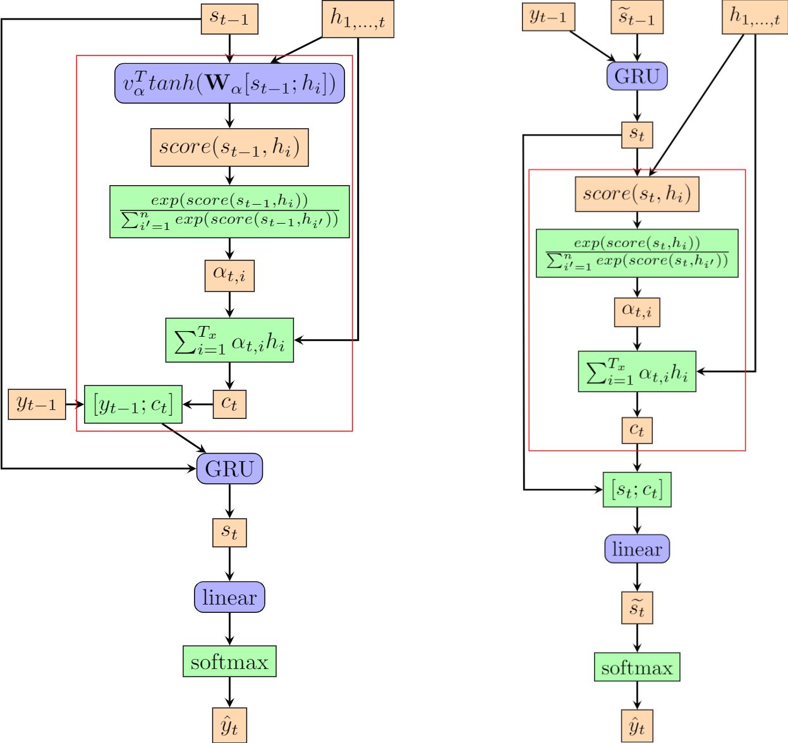
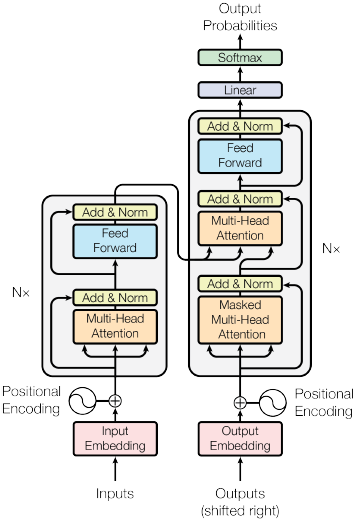
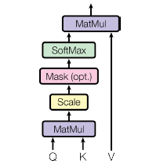

# Attention and Self-Attention for NLP

*Authors: Joshua Wagner*

*Supervisor: Matthias Aßenmacher*

Attention and Self-Attention models were some of the most influential developments in NLP.
The first part of this chapter is an overview of attention and different attention mechanisms.
The second part focuses on self-attention which enabled the commonly used models
for transfer learning that are used today. The final part of the chapter discusses the
developments made with Self-Attention and the most common transfer learning architecture today, the Transformer.

(ref:luong2015effectife) [@luong2015effective]
(ref:bahdanau2014neural) [@bahdanau2014neural]
(ref:cheng2016long) [@cheng2016long]
(ref:vaswani2017attention) [@vaswani2017attention]
(ref:weng2018attention) [@weng2018attention]
(ref:luong-att) $\overline{h}_s$

## Attention
In this part of the chapter, we revisit the Encoder-Decoder architecture that was introduced
in chapter [3](01-02-rnns-and-their-applications-in-nlp). We focus on the improvements
that were made with the development of attention mechanisms on the example of neural machine translation (NMT).

As seen in chapter 3, early
Encoder-Decoder architecture passes only the last hidden state from the encoder to the decoder.
This leads to the problem that information has to be compressed into a fixed length
vector and information can be lost in this compression.
Especially information found early in the sequence tends to be "forgotten" after
the entire sequence is processed. The addition of bi-directional layers remedies
this by processing the input in reversed order. While this helps for shorter sequences,
the problem still persists for long input sequences.
The development of attention enables the decoder to attend to the whole sequence and
thus use the context of the entire sequence during the decoding step.

### Bahdanau-Attention

In 2014, @bahdanau2014neural proposed attention to fix the information problem that
the early encoder-decoder architecture faced. Decoders without attention are trained to predict $y_{t'}$
given a fixed length context vector $c$ and all earlier predicted words $\{y_t, \dots, y_{t'-1}\}$.
The fixed length context vector is computed with
$$c=q(\{h_1,\dots,h_T\})$$ where $h_1,\dots,h_T$ are the the hidden states of the encoder for the input sequence
$x_1,\dots, x_T$ and $q$ is a non-linear function. @sutskever2014sequence for example used
$c = q(\{h_1,\dots,h_T\}) = h_T$ as their non-linear transformation which remains a popular
choice for architecture without attention. It is also commonly used for the initialisation of the decoder hidden states.

Attention changes the context vector $c$ that a decoder uses for translation from a fixed
length vector $c$ of a sequence of hidden states $h_1, \dots, h_T$ to a sequence
of context vectors $c_i$. The hidden state $h_i$ has a strong focus on the *i*-th
word in the input sequence and its surroundings.
If a bi-directional encoder is used, each $h_i$ is computed by a concatenation of the forward
$\overrightarrow{h_i}$ and backward $\overleftarrow{h_i}$ hidden states:

$$
h_i = [\overrightarrow{h_i}; \overleftarrow{h_i}], i = 1,\dots,n
$$
These new variable context vectors $c_i$ are used for the computation of the decoder hidden state $s_t$.
At time-point $t$ it is computed as $s_t = f(s_{t-1},y_{t-1},c_t)$ where $f$ is the function resulting from
the use of a LSTM- or GRU-cell.
The context vector $c_t$ is computed as a weighted sum of the hidden
states $h_1,\dots, h_{T_x}$:

$$
c_t = \sum^{T_x}_{i=1}\alpha_{t,i}h_i.
$$
Each hidden state $h_i$ is weighted by a $\alpha_{t,i}$.
The weight $\alpha_{t,i}$ for each hidden state $h_i$ is also called the alignment score.
These alignment scores are computed as:

$$
\alpha_{t,i} = align(y_t, x_i) =\frac{exp(score(s_{t-1},h_i))}{\sum^{n}_{i'=1}exp(score(s_{t-1},h_{i'}))}
$$
with $s_{t-1}$ being the hidden state of the decoder at time-step $t-1$.
The alignment score $\alpha_{t,i}$ models how well input $x_i$ and output $y_t$ match
and assigns the weight to $h_i$. @bahdanau2014neural parametrize their alignment
score with a single-hidden-layer feed-forward neural network which is jointly
trained with the other parts of the architecture. The score function used by Bahdanau et al.
is given as

$$
score(s_t,h_i) = v_\alpha^Ttanh(\mathbf{W}_\alpha[s_t;h_i])
$$
were tanh is used as a non-linear activation function and $v_\alpha$ and $W_\alpha$
are the weight matrices to be learned by the alignment model. The alignment score function
is called "concat" in @luong2015effective and "additive attention" in @vaswani2017attention
because $s_t$ and $h_i$ are concatenated just like the forward and backward hidden states seen above.
The attention model proposed by Bahdanau et al. is also called a soft/global attention model as it attends
to every input in the sequence.
A nice by-product of attention mechanisms is the matrix of alignment scores
which can be visualised to show the correlation between source and target words as seen in \@ref(fig:attention-plot-bahdanau).

```{r attention-plot-bahdanau, echo = FALSE, fig.align='center', fig.cap= "Alignment Matrix visualised for a French to English translation. White squares indicate high aligment weights between input and output. Image source: Fig 3 in (ref:bahdanau2014neural)", out.height="30%"}
knitr::include_graphics('./figures/02-02-attention-and-self-attention-for-nlp/bahdanau-fig3.png')
```


### Luong-Attention

While @bahdanau2014neural were the first to use attention in neural machine translation,
@luong2015effective were the first to explore different attention mechanisms and their impact on
NMT. Luong et al. also generalise the attention mechanism for the decoder which enables
a quick switch between different attention functions.
Bahdanau et al. only consider

$$
score(s_t,h_i) = v_\alpha^Ttanh(\mathbf{W}_\alpha[s_t;h_i]),
$$
while Luong et al. additionally introduce a general, a location-based and a dot-product score function for the global attention mechanism as described in table \@ref(tab:luong-score-functions).

| Score-function | Name           |
|----------------|----------------|
| $\text{score}(\boldsymbol{s}_t, \boldsymbol{h}_i) = \boldsymbol{s}_t^\top\mathbf{W}_a\boldsymbol{h}_i$         | General        |
| $\alpha_{t,i} = \text{softmax}(\mathbf{W}_a \boldsymbol{s}_t)$        | Location-based |
| $\text{score}(\boldsymbol{s}_t, \boldsymbol{h}_i) = \boldsymbol{s}_t^\top\boldsymbol{h}_i$        | Dot-product    |

Table \@ref(tab:luong-score-functions): (\#tab:luong-score-functions) Different score function proposed by Luong et al.

As @luong2015effective don't use a bidirectional encoder, they simplify the hidden
state of the encoder from a concatenation of both forward and backward hidden states
to only the hidden state at the top layer of both encoder and decoder.

The attention mechanisms seen above attend to the entire input sequence. While
this fixes the problem of forgetful sequential models discussed in the beginning of the chapter,
it also has the drawback that it is expensive and can potentially be impractical
for long sequences e.g. the translation of entire paragraphs or documents. These problems encountered
with global or soft attention mechanisms can be mitigated with a local or hard attention
approach. While it was used by @xu2015show for caption generation of images with a CNN
and by @gregor2015draw for the generation of images, the first application and differentiable version for NMT
is from @luong2015effective.

Different from the global attention mechanism, the local
attention mechanism at timestep $t$ first generates an aligned position $p_t$.
The context vector is then computed as a weighted average over only the set of
hidden states in a window $[p_t-D,p_t+D]$ with $D$ being an empirically selected
parameter. This constrains the above introduced computation for the context vector
to:

$$
c_t = \sum^{p_t+D}_{i=p_t-D}\alpha_{t,i}h_i.
$$

The parts outside of a sentence are ignored if the window crosses sentence
boundaries. The computation of the context vector changes compared to
the global model which can be seen in Figure \@ref(fig:attention-plots-luong).

```{r attention-plots-luong, echo = FALSE, fig.align='center', fig.cap= "Global and local attention illustrated. Encoder in blue, Decoder in red. (ref:luong-att) and $h_t$ in the image correspond to $h_t$ and $s_t$ in the previous text. Additional computations and differences to previous described architecture is found in the next sub-chapter. Image source: Fig. 2 and 3 in (ref:luong2015effectife)", out.width="100%"}
knitr::include_graphics('figures/02-02-attention-and-self-attention-for-nlp/luong2015-fig2-3.png')
```
 
 
Luong et al. introduce two different concepts for the computation of the alignment position $p_t$.

The first is the *monotonic* alignment(**local-m**).
This approach sets $p_t= t$ with the assumption that both input and output sequences
are roughly monotonically aligned.


The other approach, *predictive* alignment (**local-p**), predicts the aligned position with:
$$
p_t = S \cdot sigmoid(v_p^\top tanh(W_ph_t))
$$
where $W_p$ and $v_p$ are the parameters that are trained to predict the position.
$S$ is the length of the input sentence which leads, with the additional sigmoid function, to $p_t \in [0,S]$.
A Gaussian distribution centred around $p_t$ is placed by @luong2015effective to favour alignment points closer to $p_t$.
This changes the alignment weights to:
$$
\alpha_{t,i} = align(y_t, x_i)exp(-\frac{(i-p_t)^2}{2\sigma^2})
$$
where the standard deviation is empirically set to $\sigma = \frac{D}{2}$. This
utilization of $p_t$ to compute $\alpha_{t,i}$ allows the computation of backpropagation
gradients for $W_p$ and $v_p$ and is thus ``differentiable almost everywhere'' @luong2015effective while being less computationally expensive than global attention.

### Computational Difference between Luong- and Bahdanau-Attention

As previously mentioned, Luong et al. not only introduced different score functions in addition to Bahdanau et al.'s
concatenation/additive score function, they also generalized the computation for the context vector $c_t$.
In Bahdanau's version the attention mechanism computes the variable length context vector first which is then used as input for the decoder.
This necessitates the use of the last decoder hidden state $s_{t-1}$ as input for the computation of the context vector $c_t$:

$$
\alpha_{t,i} = align(y_t, x_i) =\frac{exp(score(s_{t-1},h_i))}{\sum^{n}_{i'=1}exp(score(s_{t-1},h_{i'}))}
$$


Luong et al. compute their context vector with the current decoder hidden state $s_t$ and modify the decoder output with the
context vector before it is processed by the last softmax layer. This allows for easier implementation of different
score functions for the same attention mechanism. Implementations of both vary e.g. [this version](https://github.com/spro/practical-pytorch/blob/master/seq2seq-translation/seq2seq-translation.ipynb) of Bahdanau attention in Pytorch concatenates the context back in after the GRU while [this version](https://www.tensorflow.org/tutorials/text/nmt_with_attention) for an NMT model with Bahdanau attention does not. Readers that are trying to avoid a headache can build upon [this version](https://www.tensorflow.org/addons/tutorials/networks_seq2seq_nmt#defining_nmt_model) from Tensorflow which uses the **AttentionWrapper** function which handels the specifics of the implementation.

An illustration of a reduced version of the two different attention
concepts can be found in Figure \@ref(fig:attention-mechanisms).


```{r attention-mechanisms, echo = FALSE, fig.align='center', fig.show="hold", fig.cap= "Bahdanau and Luong attention mechanisms illustrated. The attention layer is bounded in the red box. Orange denotes inputs, outputs and weights. Blue boxes are layers. Green boxes denote operations e.g. softmax or concatenation([x;y]).", out.width="100%"}

```
 


### Attention Models

Attention was in the beginning not directly developed for RNNs or even NLP.
Attention was first introduced in @GravesWD14 with a content-based attention mechanism
($\text{score}(\boldsymbol{s}_t, \boldsymbol{h}_i) = \text{cosine}[\boldsymbol{s}_t, \boldsymbol{h}_i]$)
for Neural Turing Machines. Their application for NLP related tasks were later developed by 
@luong2015effective, @bahdanau2014neural and @xu2015show. 
@xu2015show were the first publication to differentiate between soft/global and hard/local attention mechanisms and did this in the
context of Neural Image Caption with both mechanisms being close to what was used
by Luong et al. in the previous section. @cheng2016long were the first to introduce the concept of self-attention, the third big
category of attention mechanisms.

## Self-Attention

@cheng2016long implement self-attention with a modified LSTM unit, the Long Short-Term
Memory-Network (LSTMN). The LSTMN replaces the memory cell with a memory network to enable
the storage of ``contextual representation of each input token with
a unique memory slot and the size of the memory
grows with time until an upper bound of the memory
span is reached'' @cheng2016long.
Self-Attention, as the name implies, allows an encoder to attend to other parts of the input during processing as seen in Figure \@ref(fig:self-attention-cheng).


```{r self-attention-cheng, echo = FALSE, fig.align='center', fig.cap= "Illustration of the self-attention mechanism. Red indicates the currently fixated word, Blue represents the memories of previous words. Shading indicates the degree of memory activation. Image source: Fig. 1 in (ref:cheng2016long).", out.width="100%"}
knitr::include_graphics('figures/02-02-attention-and-self-attention-for-nlp/cheng2016-fig1.png')
```

While the LSTMN introduced self-attention, it retains the drawbacks that come from
the use of a RNN which are discussed at the end of the Transformer section. @vaswani2017attention propose the Transformer architecture which uses
self-attention extensively to circumvent these drawbacks.

### The Transformer

RNNs were, prior to Transformers, the state-of-the-art model for machine translation, language modelling
and other NLP tasks. But the sequential nature of a RNN precludes parallelization within
training examples. This becomes critical at longer sequence lengths as memory constraints
limit batching across examples. While much has been done to minimize these problems,
they are inherent in the architecture and thus still remain. An attention mechanism
allows the modelling of dependencies without regard for the distance in either input
or output sequences. Most attention mechanisms,
as seen in the previous sections of this chapter, use recurrent neural networks.
This limits their usefulness for transfer learning because of the previously mentioned
constraints that recurrent networks have. Models like ByteNet from @kalchbrenner2016neural
and ConvS2S from @gehring2017convolutional alleviate the problem with sequential models
by using convolutional neural networks as basic building blocks. ConvS2S has a
linear increase in number of operations to relate signals from two arbitrary
input or output positions with growing distance. ByteNet has a logarithmical increase
in number of operations needed. The Transformer architecture from @vaswani2017attention
achieves the relation of two signals with arbitrary positions in input or output
with a constant number of operations. It was also the first model that relied entirely
on self-attention for the computation of representations of input or output without
using sequence-aligned recurrent networks or convolutions. 

While the Transformer architecture doesn't use recurrent or convolutional networks,
it retains the popular encoder-decoder architecture.


```{r encoder-transformer, echo = FALSE, fig.align='center', fig.cap= "Single layer of the Encoder of a Transformer with two distinct sub-layers each with residual connections and a LayerNorm. Original image: (ref:vaswani2017attention),\\ Additions and cropping: (ref:weng2018attention)", out.width="60%"}
knitr::include_graphics('figures/02-02-attention-and-self-attention-for-nlp/transformer-encoder.png')
```

The encoder is composed of a stack of N = 6 identical layers. Each of these layers
has two sub-layers: A multi-head self-attention mechanism and a position-wise fully
connected feed-forward network. The sub-layers have a residual connection around
the main components which is followed by a layer normalization. The output of each sub-layer
is $\text{LayerNorm}(x + \text{Sublayer}(x))$ where $\text{Sublayer}(x)$ is the output of the
function of the sublayer itself. All sub-layers and the embedding layer before the
encoder/decoder produce outputs of $dim = d_{model} = 512$ to allow these residual connections to work.
The position-wise feed-forward network used in the sublayer is applied to each position
separately and identically. This network consists of two linear transformations with
a ReLU activation function in between:

$$
FFN(x) = max(0, xW_1 + b_1)W_2 + b_2
$$


The decoder is, as seen in Figure \@ref(fig:decoder-transformer), composed of a stack of $N = 6$ identical layers.
```{r decoder-transformer, echo = FALSE, fig.align='center', fig.cap= "Decoder of a Transformer, Original image: (ref:vaswani2017attention),\\ Additions and cropping: (ref:weng2018attention)", out.width="50%"}
knitr::include_graphics('figures/02-02-attention-and-self-attention-for-nlp/transformer-decoder.png')
```
It inserts, in addition to the two already known sub-layers from the encoder,
a third sub-layer which performs multi-head attention over the output of the encoder stack.
It uses, same as the encoder, residual connections around each of the sub-layers.
The decoder also uses a modified, masked self-attention sub-layer ``to prevent positions
from attending to subsequent positions'' @vaswani2017attention. This, coupled with the
fact that the output embeddings are shifted by one position to the right ensures that
the predictions for position $i$ only depend on previous known outputs.

```{r transformer-full, echo = FALSE, fig.align='center', fig.cap= "The Transformer-model architecture, Image Source: Fig. 1 in (ref:vaswani2017attention)", out.height="50%"}

```

As seen in \@ref(fig:transformer-full), the Transformer uses positional encodings
added to the embeddings so the model can make use of the order of the sequence.
@vaswani2017attention use the sine and cosine function of different frequencies:

$$
PE_{(pos,2i)} = \sin(pos/10000^{2i/d_{model}})
$$
$$
PE_{(pos,2i+1)} = \cos(pos/10000^{2i/d_{model}})
$$
For further reasoning why these functions were chosen see @vaswani2017attention.

#### The self-attention mechanism(s)

@vaswani2017attention describe attention functions as "mapping a query and a set of key-value pairs to an output,
where the query, keys, values, and output are all vectors. The output is computed as a weighted sum
of the values, where the weight assigned to each value is computed by a compatibility function of the
query with the corresponding key". The *Q*uery and the *K*ey-*V*alue pairs are used in the
newly proposed attention mechanism that is used in Transformers.
As seen in Figures \@ref(fig:encoder-transformer), \@ref(fig:decoder-transformer)
and \@ref(fig:transformer-full), the Transformer uses an attention mechanism called
``Multi-Head Attention''.

```{r multi-head-attention, echo = FALSE, fig.align='center', fig.cap= "Multi-Head Attention, Image Source: Fig. 2 in (ref:vaswani2017attention)", out.width="50%"}
knitr::include_graphics('figures/02-02-attention-and-self-attention-for-nlp/multi-head-attention.png')
```

The multi-head attention projects the queries, keys and values $h$ times instead of performing
a single attention on $d_{model}$-dim. queries and key-value pairs. The projections
are learned, linear and project to $d_k$, $d_k$ and $d_v$ dimensions. Next the
new **scaled dot-product attention** is used on each of these to yield a $d_v$-dim. output.
These values are then concatenated and projected to yield the final values as can be
seen in \@ref(fig:multi-head-attention). This multi-dimensionality allows the attention
mechanism to jointly attend to different information from different representation
at different positions. The multi-head attention can be written as:

$$
\text{MultiHead}(Q,K,V) = \text{Concat}(\text{head}_1,\dots, \text{head}_h)W^O
$$

$$
\text{where } \text{head}_i = \text{Attention}(QW_i^Q, KW_i^K, VW_i^V)
$$
and projections are the parameter matrices $W_i^Q\in \mathbb{R}^{d_{model}\times d_k}, W_i^K\in \mathbb{R}^{d_{model}\times d_k}, W_i^V\in \mathbb{R}^{d_{model}\times d_v}\text{ and } W^O\in \mathbb{R}^{hd_{v}\times d_{model}}$.
@vaswani2017attention use $h = 8$ and $d_k = d_v = d_{model}/h = 64$. This reduced dimensionality
leads to a reduction in computational cost that is similar to that of a single scaled-dot-product attention head
with the full initial dimensionality of $512$.

The *scaled dot-product attention* is, as the name suggests, just a scaled version
of the dot-product attention seen previously in this chapter. 
```{r scaled-dot-prod-attention, echo = FALSE, fig.align='center', fig.cap= "Scaled Dot-Product Attention, Image Source: Fig. 2 in (ref:vaswani2017attention)", out.width="50%"}

```

The optional *Mask*-function seen in Fig. \@ref(fig:scaled-dot-prod-attention) is
only used in the masked-multi-head attention of the decoder. The querys and
keys are of dim. $d_k$ and the values are of dim. $d_v$. The attention
is for practical reasons computed for a set of queries, *Q*. The keys and values
are thus also used in matrix format, *K* and *V*. The matrix of outputs is then
computed as:

$$
\text{Attention}(Q,K,V) = \text{softmax}(\frac{QK^\top}{\sqrt{d_k}})V
$$
where $\text{Attention}(Q,K,V)$ corresponds to an non-projected head of multi-head attention.
These attention mechaisms allow Transformers to learn different and distant dependencies in langauge
and are thus a good candidate for transfer learning.

#### Complexity for different attention models

The architecture of a Transformer allows for parallel encoding of every part of the
input at the same time. This also enables the modelling of long-range dependencies regardless
of the distance.
The Transformer architecture, as a minimum, only needs a constant number of sequential operations regardless of
input length $n$ due to extensive parallelization as can be seen in Table \@ref(tab:complexity-operations).
A RNN based model in comparison needs a linearly scaling number of sequential operations due to its architecture.
The Maximum Path Length between long-range dependencies for a transformer is $O(1)$ while the RNN
again has $O(n)$ due to its sequential input reading.

The fast modelling of long-range dependencies and the multiple attention heads which learn different
dependencies makes Transformers a favourable choice for Transfer Learning.
The transfer learning models that were developed from the Transformer architecture
enabled models which were trained on more data to gain a deeper understanding about
language and are state-of-the-art today (June, 2020). 

They are also a popular research topic as they are quadraticlly scaling, with regard to input length, complexity per layer
inhibits their use for very long sequences and makes them time consuming to train.
This quadratic complexity comes from the self-attention mechanism $\text{Attention}(Q,K,V) = \text{softmax}(\frac{QK^\top}{\sqrt{d_k}})V$.
The used softmax needs to calculate the attention score between the currently processed input $x_i$ and every
other input $x_j$ for each $j \in {1, \dots ,n}$ and $i \in {1, \dots ,n}$. This limits the length of the
context that Transformers can process and increases the time they need for training in practical uses.
The computational costs are especially severe in very long tasks.

In the last few years new variations of the vanilla transformer, as described previously in the chapter, were published
which lower the computational cost (e.g. @shen2018efficient and @choromanski2020masked). 
Some of these variations of the Transformer architecture managed to decrease the complexity
from quadratic to $O(N\sqrt{N})$ (@child2019generating), $O(N\log N)$ (@kitaev2020reformer) or $O(n)$ (@wang2020linformer) as seen in Table \@ref(tab:complexity-operations).

|Layer-type | Complexity per Layer | Sequential Operations | 
|-----------|----------------------|-----------------------|
| Recurrent | $O(n \cdot d^2)$ | $O(n)$ |
| Convolutional | $O(k \cdot n \cdot d^2)$ | $O(1)$ |
| Transfomer | $O(n^2 \cdot d)$ | $O(1)$ |
| Sparse Transfomer | $O(n\sqrt{n})$ | $O(1)$ |
| Reformer | $O(n \log (n))$ | $O(\log (n))$|
| Linformer| $O(n)$ | $O(1)$|
| Linear Transformer | $O(n)$ | $O(1)$|

Table \@ref(tab:complexity-operations) : (\#tab:complexity-operations) Complexity per layer and the number of sequential operations. Sparse Transformers are from @child2019generating, Reformer from @kitaev2020reformer, Linformer from @wang2020linformer and Linear Transformers from @katharopoulos2020transformers. $n$ is the sequence length, $k$ the kernel size, $d$ the representation dimension and $r$ the size of the neighbourhood in restricted self-attention. Source: @vaswani2017attention (Table 1) and @wang2020linformer (Table 1)


### Transformers as RNNs

A version from @katharopoulos2020transformers uses a linear attention mechanism for
autoregressive tasks. The vanilla Transformer uses, as described above, the softmax to
calculate the attention between values. This can also be seen as a similarity function.
$V_i' = \frac{\sum_{j=1}^N \text{sim}(Q_i, K_j)V_j}{\sum_{j=1}^N\text{sim}(Q_i, K_j)}$ is equal to
the row-wise calculation of $\text{Attention}(Q,K,V) = V' = \text{softmax}(\frac{QK^\top}{\sqrt{d_k}})V$
if $\text{sim}(q,k)=\exp(\frac{q^\top k}{\sqrt{d_k}})$. While we can use the exponentiated
dot-product to generate the vanilla scaled-dot-product attention, we can use any non-negative
function, including kernels, as similarity function to generate a new attention mechanism @katharopoulos2020transformers.
Given the feature representation $\phi(x)$ of such a kernel, the previous row-wise calculation
can be rewritten as $V_i' = \frac{\phi(Q_i)^\top \sum_{j=1}^N\phi(K_j)V_j^\top}{\phi(Q_i)^\top \sum_{j=1}^N\phi(K_j)}$.
Or in vectorized form: $\phi(Q)(\phi(K)^\top V)$ where the feature map $\phi(\cdot)$ is applied row-wise to the matrices.
This new formulation shows that the computation with a feature map allows for linear time and memory scaling $O(N)$
because $\sum_{j=1}^N\phi(K_j)V_j^\top$ and $\sum_{j=1}^N\phi(K_j)$ can be both computed once and reused for every
row of the query @katharopoulos2020transformers. 
No finite dimensional feature map of the exponential function exists, which makes a linearisation of the
softmax attention impossible. This forces the use of a polynomial kernel which has been shown to work equally well with
the exponential kernel @tsai2019transformer. This results in a computational cost of
$O(ND^2M)$ which is favourable if $N > D^2$. @katharopoulos2020transformers suggest $\phi(x) = \text{elu}(x) + 1$ for $N < D^2$.

For autoregressive tasks we want an attention mechanism that can't look ahead of its position.
@vaswani2017attention introduced masked-self-attention for their decoder, which is adapted for linearised attention.
The addition of masking changes the previous formulation to $V_i' = \frac{\sum_{j=1}^i \text{sim}(Q_i, K_j)V_j}{\sum_{j=1}^i\text{sim}(Q_i, K_j)}$.
With the linearisation through kernels we get $V_i' = \frac{\phi(Q_i)^\top \sum_{j=1}^i\phi(K_j)V_j^\top}{\phi(Q_i)^\top \sum_{j=1}^i\phi(K_j)}$.

$S_i = \sum_{j=1}^i\phi(K_j)V_j^\top$ and $Z_i = \sum_{j=1}^i\phi(K_j)$ can be used to simplify the formula to
$$
V_i' = \frac{\phi(Q_i)^\top Si}{\phi(Q_i)^\top Z_i}
$$
where  $S_i$ and $Z_i$ can be computed from $S_{i-1}$ and $Z_{i-1}$ which allows the linearised attention
with masking to scale linearly with respect to the sequence length. The derivation of
the numerator as cumulative sums allows for the computation in linear time and constant memory,
which leads to computational complexity of $O(NCM)$ and memory $O(N \max{(C,d_k)})$ where $C$ is the dimensionality of
the feature map @katharopoulos2020transformers.

Given the previous formalization of feature maps to replace the softmax we can rewrite the
layers of a Transformers as a RNN. This RNN has two hidden states, the attention state $s$ and the
normalizer state $z$ with subscripts denoting the timestep in recurrence.
With $s_0 = 0$ and $z_0 = 0$ we can define $s_i$ as $s_i s_{i-1} + \phi(x_iW_K)(x_iW_V)^\top$ and
$z_i$ as $z_i = z_{i-1} + \phi(x_iW_K)$ with $x_i$ as the $i$-th input for the layer.
The $i$-th output $y_i$ can then be written as $y_i = f_l(\frac{\phi(x_iW_Q)^\top s_i}{\phi(x_iW_Q)^\top z_i} + x_i)$
where $f_l$ is the function given by the feed-forward network of a Transformer layer.

This shows that the Transformer layers can be rewritten into RNN layers, for all similarity functions
that can be represented with $\phi$ (@katharopoulos2020transformers), which are the first models
that used attention for NLP tasks.