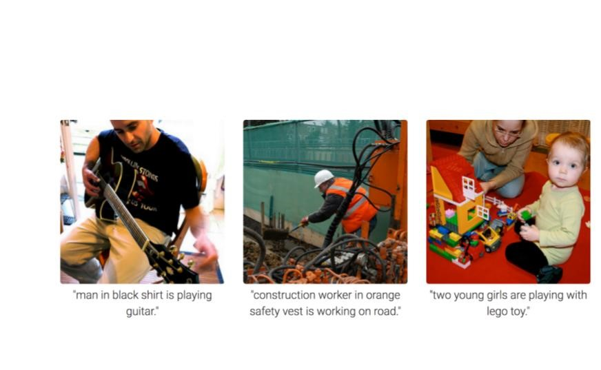
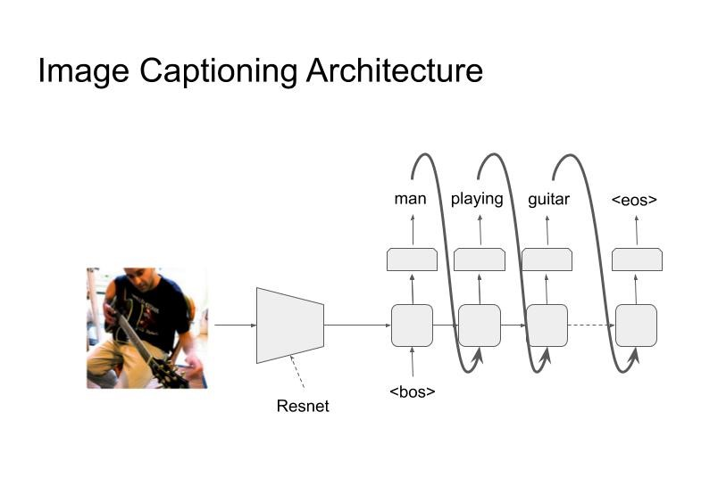
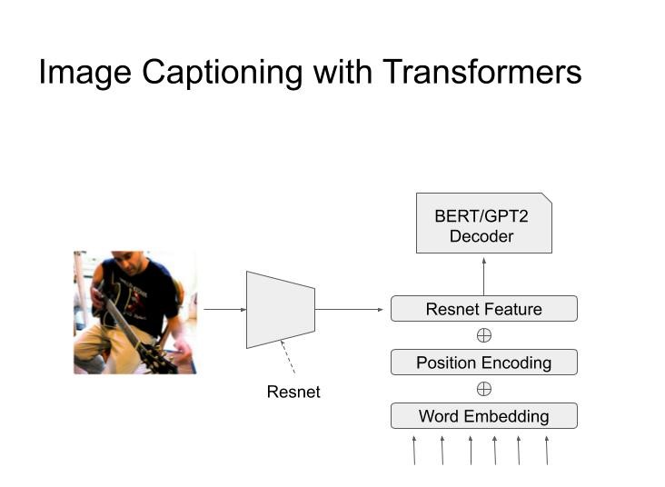
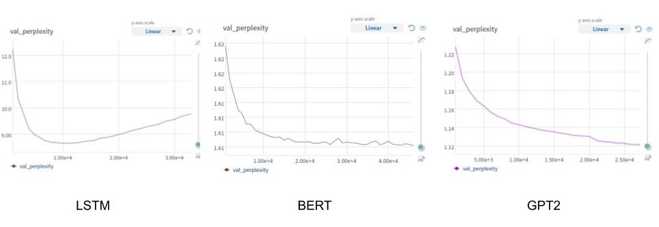

---
output:
  word_document: default
  html_document: default
  pdf_document: default
---
# Natural Language Generation

*Author: Haris Jabbar*

*Supervisor: Matthias Aßenmacher*

## Introduction

Machine learning systems can be differentiated into two types: Discriminative and Generative. While discriminative systems like classification, regression, clustering are the more well known type, it's the Generative systems that hold greater promise of achieving Artificial General Intelligence. In essence, a Generative system is expected to produce images, text or audio that would be meaningful to the users. Generating a picture of a horse is a much harder problem than just identifying whether there is a horse in the picture.

In this chapter, I will tackle the generative processes in NLP. Understandably, the field is called Natural Language Generation (NLG).

## Definition and Taxonomy

Reiter and Dale (2000) defined Natural Language Generation (NLG) as “the sub-field of artificial intelligence and computational linguistics that is concerned with the construction of computer systems than can produce understandable texts in English or other human languages from some underlying non-linguistic representation of information”.

Two aspects need to be highlighted. First is generation of *understandable* text in a human language and second is the input to such a generation system is *non-linguistic* representation of information. For our purposes, we will drop the second requirement; which means that the source can be text as well. With such a definition in mind, we can have following taxonomy of NLG systems :

1. Text-to-Text
    - Machine Translation : Automatically translating between various human languages
    - Text Summarization : Summarizing a (big) text document into a shorter summary/abstract.

2. Data-to-Text

    - Image Captioning : Describe the image in a short sentence.
    - Video Captioning : Generate captions that change with the video scenes. 
    - Business Intelligence : Creating text summaries of data from conventional databases (e.g SQL)

3. Ideas-to-Text
    - Poetry/Song Generation : Generating a song from a few keywords or mimicking the style of a certain artist.
    - Fake News : Automatically generating news items that look credible but are not.

4. Dialog Systems (Chatbots)
    - Goal Oriented : Chatting with a computer system (agent) with a specific purpose (e.g. booking a flight)
    - Open ended conversations : When the conversation with the agent is casual chit-chat but has the components of information, emotion and human like empathy.


## Common Architectures

There are many architectures that are common across NLG systems. While some are used in other NLP domains as well, in the following sections I will explain them with a focus on language generation.

### Encoder-Decoder Architecture
The most ubiquitous architecture for NLG is the encoder-decoder architecture, and especially the decoder part of it. Hence I will explain it in some detail. The architecture is shown in the subsequent figures.

The architecture can be seen as modeling conditional probability $P(y/x)$ with $y$ being the output of the decoder and it is conditioned on $x$ (the output of the encoder). Hence the NLG task becomes generating text through decoder conditioned on some input, coming from the encoder.


#### Encoder :
As stated above, the purpose of this part of the network is to provide conditional information on which the decoder generates text. As such, this part can have **ANY** architecture that provides some form of embedding of the input. It can be a convolutional neural network to condition the generated text on some properties of an image (for example image captioning), or RNN/LSTM/Transformer architecture for text or audio based conditioning; or even a simple feed forward network to condition it on relational database for example. For the purpose of illustration we will be using an RNN/LSTM with text as input condition (as shown in the figure).

The thing to note here is that the richer the feature vector going from encoder to decoder, the more information decoder would have to generate  output. This was the motivation to move from single feature vector to multiple vectors and to attention based models. This trend finally led to the transformer based models.


#### Decoder :
The decoder is the most distinctive part of an NLG system. Almost all decoders have the same form as shown in the figures above. The purpose is to generate text tokens one after the other until a terminating criteria is met. This termination is usually a termination token (\<end> in the figures) or a max length criteria.

During training, we are given an input (text/image/audio) and the 'gold label text' that we want the system to learn to generate for that particular input. In the given example, the input is the text "How are you?" and the gold label is "I am good". The input goes through the encoder and produces a feature vector that is used as the input to decoder. The decoder then generates tokens one by one and the loss is calculated after the softmax layer from the generated token and the gold label token. Note the inclusion of an extra token '\<null>' as the first token. The last token of the gold label should produce the '\<end>' token.

During inference, we don't have the gold label, so the output of one step is used as input to next step, as shown in the figure. Note that it matches with the setup during training. The generator stops when '\<end>' token is emitted; thus completing the inference.

### Attention Architecture

The attention architecture is introduced in detail in [Chapter 9](./02-02-attention-and-self-attention-for-nlp.html). Here I will briefly mention its use in NLG systems. Looking at the picture below, we can see that the attention is from decoder to encoder.


In other words, before generating each token, the decoder attends to all tokens in the encoder. The query is the decoder token and key/values are all encoder token. That way the decoder has much richer information to base its output on.

### Decoding Algorithm at Inference

Now I will explain the decoding algorithms that are used to generate text from the softmax layer.

As explained above, during inference, the tokens are generated sequentially. In a vanilla version of decoding, at each step of the sequence, the token with highest probability in the softmax layer is generated. This is called 'greedy decoding', but it has been shown to produce suboptimal text. There are few improvements over this greedy approach.

#### Beam Search

In greedy decoder we simply output the maximum probability token at each step. But if we track multiple words at each step and then output the sequence formed by highest probability combination, we get beam search. The number of tokens we keep track of is the length of beam (k). The algorithm then goes as follows:

1. Select k-tokens with highest probability at step 1.
2. Use these k-tokens to generate k softmax vectors at step 2.
3. Keep the k highest scoring combinations.
4. Repeat steps 2 and 3 till \<end> token is generated, or a predefined max is reached
5. At each step, we have only k-hypothesis, which is the length of beam search.

While beam search tends to improve the quality of generated output, it has its own issues. Chiefly among them is that it tends to produce shorter sequences. Although it can be controlled by the max parameter (of step 4), it's another hyperparameter to be reckoned with.

#### Pure Sampling Decoder

Here, at each step, instead of taking the token with maximum probability like in greedy search, the token is sampled from the whole vocabulary according to the probability distribution predicted by the softmax layer.

#### K-sampling Decoder

It's like pure sampling decoder, but instead of sampling from whole vocabulary, the token is sampled only from the k-highest probability tokens.

### Memory Networks

Memory Networks is another architecture that is potentially quite useful in language generation tasks. The basic premise is that LSTMs/RNNs and even Transformer architecture stores all the information only in the weights of the network. When we want to generate text that should include information from a large knowledge base, this 'storage' of network weights is insufficient. Memory networks resolve this problem by employing an external storage (the memory) that it can use during language generation. Conceptual diagram is showing in the following figure, followed by a brief description.


Memory (M) in this context can be any database that can be queried by the network. Usually it is of the form of key-value pairs or a simple array of vectors embedding a corpus of knowledge (eg DBPedia/wikipedia). For any query input (x), first we get an embedding. This is then used to attend over the memory M in the usual attention mechanism ([Chapter 9](./02-02-attention-and-self-attention-for-nlp.html)). The output is the weighted sum of memory that incorporates information from complete knowledge corpus. In some cases the output can also be used to update the memory database.

### Language Models

Language models are probably the most important ingredient of generating text. As the name implies, they model the probability distribution of generating words and characters. More concretely, they model the conditional probability distribution P(w_t/w_{t-1}). Thus with a given input vector coming from a source (image/database/text), this model can be used to generate words one after the other.

<!-- ## Question-Answer Systems -->

<!-- The question-answer systems attempt to extract or generate answers from a given question and either a fixed or open ended context. The context here is the corpus from which the answer needs to be generated. For example in SQUAD dataset (\cite) the context is a given paragraph from wikipedia and the question is asked from that paragraph. In open ended contexts, the whole wikipedia (or other corpus) can be the contexts. -->

<!-- ### Datasets -->
<!-- - msmarco -->
<!-- - google natural questions -->
<!-- - multiple choice -->
<!--     - swag/trivia qa -->
<!-- - conversational qa -->
<!--     - coqa, wizard of wikipedia, quac.ai -->
<!-- - many others e.g. visual qa, KB qa etc. -->

<!-- ### Types -->

<!-- - Question Answer Systems -->
<!--     - Structured knowledge source -->
<!--     The sources can be e.g. Freebase, Wikidata, DBpedia or RDBMS systems -->
<!--     - Unstructured knowledge soure -->
<!--     Free text e.g. Wikipedia -->
<!--     - FAQs -->
<!--     Extract answers for similar questions to the given in a corpus of question-answer pairs. -->

<!-- ### Architectures -->

<!-- - Context -->
<!-- - Question -->

<!-- Five conceptual levels -->
<!-- - Token level features (embeddings) -->
<!-- - Context and question encoder -->
<!-- - Attention from context to question or vice versa -->
<!-- - Modeling layer -->
<!-- - Output layer -->

<!-- - Pointer Networks -->

<!-- - Open Domain QA -->
<!--     - DrQA -->
<!--     - Distant Supervision -->

<!-- ### Evaluation Metrics -->
<!-- There are generally two metrics commonly used in QA systems. The exact match (EM) and F1 score. -->

## Dialog Systems

These are the systems where an agent chats with a human being either with a specific purpose (goal oriented) or it is a general open ended chat. The examples of goal oriented chats include tasks like booking an appointment or a flight ticket. Open ended chats can be talking about a general topic which may or may not include a 'personality' for the chatbot.

### Types

- Chatbots
    - Open domain
    - Goal Oriented


### Architectures
Chatbots are complex software systems involving many modules and components that interact with each other asynchronously and in an event-driven fashion. An example architecture is shown in the following figure. This is an example of a goal-oriented chatbot which helps the use make a flight reservation. Following could be an example sequence of steps

1. The first step is to decode the text coming from a user. The two types of decoders that are usually required are an 'intent classifier' and a 'Named Entity Recognizer (NER)'. The intent classifier tries to determine the intent of the command coming from the user. So for the given example the command is 'Book a flight to Berlin on Tuesday', the correct classification would be 'book-flight'.

2. This intent is then fed to a 'State Space' module that keeps a list of entities that are required for each intent. For 'book-flight' intent, it would need entities like destination, date of flight, time of flight, airline/cost preferences etc. The NER in step 1 tries to extract these entities from the command. In our example, it could extract the destination and date of travel.

3. The conversation state manager keeps track of which entities have been resolved and which are outstanding. For both resolved and outstanding entities it refers to 'Action Space' module that generates API calls to external databases for requested parameters. It also refers to a 'Natural Language Understanding (NLU) model' to extract the information it needs to resolve the entities. 

4. The 'Action Space' module calls various airline APIs and databases for associated tasks like determine available flights, prices and timings etc. Based on this information it refers back to the user to ask for unresolved entities. 

5. The cycle continues till the system has all the required information to carry out the task.

A chatbot touches upon all areas of NLP and NLG; for example in the above case, it would need QnA ability, text generation, summarization, information retrieval and classification, to name a few. 


    

    
## Image Captioning System

As the name suggests, these systems attempt to capture the caption of a given image as shown in the following figure. The input to the system is an image which is reduced to a feature vector using an appropriate architecture. Usually convolution based pretrained architectures are employed at this stege. The feature vector is then fed to a decoder network that produces the caption of the image. (See figure 2).



### Experiments

For this seminar, I implemented a network for this task. For the encoder part, I used a pretrained Resnet backbone with a trainable fully connected layer appended after that. This gave me a feature vector for an image. For decoder part, I used three different kind of decoder architectures. 

- Simple LSTM Layer
- BERT decoder
- GPT-2 decoder

However, these decoders expect a multi-token input feature embedding on which attention can be implemented. But I have only one feature vector, so it cannot be used as-is in the decoder network. Therefore I came up with a different architecture in which this feature vector is added to the word and position embeddings of each output token (as shown in figure 3).



### Implementation
The network was implemented in PyTorch, using the Pytorch-Lightning and Nepture.AI frameworks for experimentation. I used MS-COCO dataset (2017) which had image captioning task. The encoder and LSTM decoder code is appended below for reference, while the BERT and GPT2 decoders were used from the HuggingFace library.

```
class EncoderCNN(nn.Module):
    def __init__(self, embed_size):
        """Load the pretrained ResNet-152 and replace top fc layer."""
        super(EncoderCNN, self).__init__()
        resnet = models.resnet152(pretrained=True)
        modules = list(resnet.children())[:-1]      # delete the last fc layer.
        self.resnet = nn.Sequential(*modules)
        self.linear = nn.Linear(resnet.fc.in_features, embed_size)
        self.bn = nn.BatchNorm1d(embed_size, momentum=0.01)
        
    def forward(self, images):
        """Extract feature vectors from input images."""
        with torch.no_grad():
            features = self.resnet(images)
        features = features.reshape(features.size(0), -1)
        features = self.bn(self.linear(features))
        return features
```

```
class DecoderRNN(nn.Module):
    def __init__(self, embed_size, hidden_size, vocab_size, num_layers, max_seq_length=20):
        """Set the hyper-parameters and build the layers."""
        super(DecoderRNN, self).__init__()
        self.embed = nn.Embedding(vocab_size, embed_size)
        self.lstm = nn.LSTM(embed_size, hidden_size, num_layers, batch_first=True)
        self.linear = nn.Linear(hidden_size, vocab_size)
        self.max_seg_length = max_seq_length
        
    def forward(self, features, captions, lengths):
        """Decode image feature vectors and generates captions."""
        embeddings = self.embed(captions)
        embeddings = torch.cat((features.unsqueeze(1), embeddings), 1)
        packed = pack_padded_sequence(embeddings, lengths, batch_first=True) 
        hiddens, _ = self.lstm(packed)
        outputs = self.linear(hiddens[0])
        return outputs
    
    def sample(self, features, states=None):
        """Generate captions for given image features using greedy search."""
        sampled_ids = []
        inputs = features.unsqueeze(1)
        for i in range(self.max_seg_length):
            hiddens, states = self.lstm(inputs, states) # hiddens: (batch_size, 1, hidden_size)
            outputs = self.linear(hiddens.squeeze(1))   # outputs:  (batch_size, vocab_size)
            _, predicted = outputs.max(1)               # predicted: (batch_size)
            sampled_ids.append(predicted)
            inputs = self.embed(predicted)              # inputs: (batch_size, embed_size)
            inputs = inputs.unsqueeze(1)                # inputs: (batch_size, 1, embed_size)
        sampled_ids = torch.stack(sampled_ids, 1)   # sampled_ids: (batch_size, max_seq_length)
        return sampled_ids
```

### Results

For evaluation, I used perplexity on a held out validation set. The results for the three architectures are shown in the following figure. It can be seen that BERT outperforms LSTM with a lower perplexity and GPT2 outperforms both LSTM and BERT model. 




## Conclusion

In humanity's search for Artificial General Intelligence (AGI), natural language plays a crucial part. It is not only one of the fundamental ways to communicate with other beings, it also gives deep insight to how intelligent beings understand the world around them. And as I stated in the introduction, the best way to understand something is to be able to create/generate it. Hence natural language generation will continue to play an important part in AGI. In this chapter I have talked about only few of its manifestations; but there is a lot of scope to work in this domain. 
