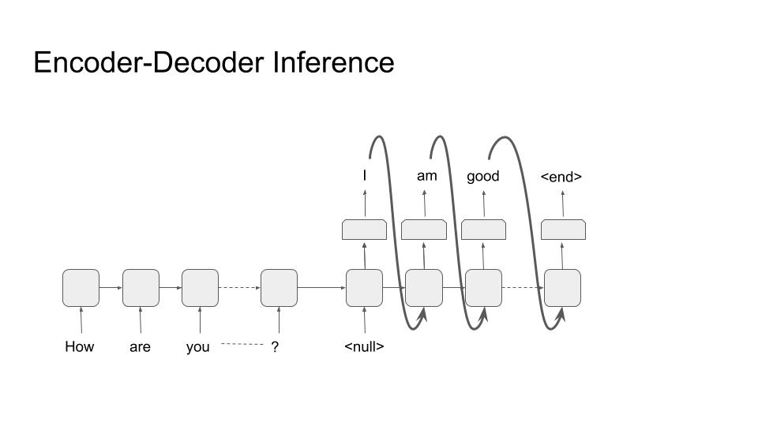
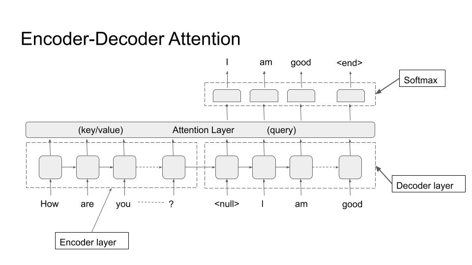

# Natural Language Generation

*Author: Haris Jabbar*

*Supervisor: Matthias Aßenmacher*

## Introduction

Machine learning systems can be differentiated into two types : Discriminative and Generative. While discriminative systems like classification, regression, clustering are the more well known type, it's the Generative systems that hold greater promise of achieving Artificial General Intelligence. In essence, a Generative system is expected to produce images, text or audio that would be meaningful to the users. That's a much harder problem than just identifying a horse in a picture or fitting a line through a set of datapoints.

In this chapter, I will tackle this generative process in Natural Language Processing domain. Understandably, it's called Natural Language Generation (NLG).

## Definition

Reiter and Dale (2000) defined Natural Language Generation (NLG) as “the sub-field of artificial intelligence and computational linguistics that is concerned with the construction of computer systems than can produce understandable texts in English or other human languages from some underlying non-linguistic representation of information”

## Domains of NLG Systems

NLG systems have a wide variety of application areas. 

1. Text-to-Text
    - Machine Translation
    - Text Summarization

2. Data-to-Text
    - Image Captioning
    - Business Intelligence

3. Ideas-to-Text
    - Poetry/Song Generation
    - Mimic an artist
    - Fake News

4. Dialog Systems (Chatbots)
    - Goal Oriented
    - Open ended conversations

## Commercial Activity

1. https://www.narrativescience.com 
2. https://automatedinsights.com 
3. http://www.arria.com

# The Architectures

There are many architectures that are peculiar to an NLG system. While some are used in other domains as well, in the following sections I will explain them with a focus on language generation.

## Encoder-Decoder Architecture
The most ubiquitous architecture for NLG is the encoder-decoder architecture, and especially the decoder part of it. Hence I will explain it in some detail. The architecture is shown in following figures:

The architecture can be seen as conditional probability P(y/x) with 'y' being the decoder and it is conditioned on 'x' (the encoder). Hence the NLG task becomes generating text through decoder conditioned on some input, coming from the encoder.

### Encoder :
As stated above, the purpose of this part of the network is to provide conditional information on which the decoder generates text. As such, this part can have ANY architecture. It can be a convolutional neural network for image based conditioning, or RNN/LSTM/Transformer architecture for text or audio based conditioning. But for the purpose of illustration we are using an RNN/LSTM and text as input condition. 

The thing to note here is that the richer the feature vector going from encoder to decoder, the more information decoder would have to generate better output. This was the motivation to move from single feature vector (\cite) to multiple vectors and subsequently to a transformer based architecture. 

### Decoder :
The decoder is the most distinctive part of an NLG system. Almost all decoders have the same form as shown in the figures above. The purpose is to generate text tokens (\cite) one after the other until a terminating criteria is met. This termination is usually a termination token (\<end> in the figures).

During training, we are given an input (text/image/audio) and the 'gold label text' that we want the system to learn to generate for that particular input. In the given example, the input is text "How are you?" and the gold label is "I am good". The input goes through the encoder and produces a feature vector that is used as the input to decoder. The decoder than generates tokens one by one and the loss is calculated after the softmax layer from the generated token and the gold label token. Note the inclusion of an extra token '\<null>' as the first token. The last token of the gold label should produce the '\<end>' token. 

During inference, we don't have the gold label, so the output of one step is used as input to next step, as shown in the figure. Note that it matches with the setup during training. The generator stops when '\<end>' token is emitted; thus completing the inference.

## Attention Architecture

The attention architecture is introduced in detail in section (\cite). Here I will briefly mention its use in NLG systems. Looking at the picture below, we can see that the attention is from decoder to encoder.

In other words, before generating each token, the decoder attends to all tokens in the encoder, as shown. The query is the decoder token and key/values are all encoder token. That way the decoder has much richer information to base its output on. 

## Decoding Algorithm at Inference

Now I will explain the decoding algorithms that are used to generate text from the softmax layer.

As explained above, during inference, the tokens are generated sequentially. In a vanilla version of decoding, at each step of the sequence, the token with highest probability in the softmax layer is generated. This is called 'greedy decoding', but it has been shown to produce suboptimal text. There are few improvements over this greedy approach.

### Beam Search

In greedy decoder we simply output the maximum probability token at each step. But if we track multiple words at each step and then output the sequence formed by highest probability combination, we get beam search. The number of tokens we keep track of is the length of beam (k). The algorithm than goes as follows:

1. Select k-tokens with highest probability at step 0. 
2. Use these k-tokens to generate k softmax vectors at step 1.
3. Keep the k highest scoring combinations. 
4. Repeat steps 2 and 3 till \<end> token is generated, or a predefined max is reached
5. At each step, we have only k-hypothesis, which is the length of beam search.

While beam search tends to improve the quality of generated output, it has its own issues. Chiefly among them is that it tends to produce shorter sequences. Although it can be controlled by the max parameter (of step 4), it's another hyperparameter to be reckoned with. 

### Pure Sampling Decoder

Here, at each step, instead of taking the token with maximum probability like in greedy search, the token is sampled from the whole vocabulary according to the probability distribution predicted by the softmax layer.

### K-sampling Decoder

It's like pure sampling decoder, but instead of sampling from whole vocabulary, the token is sampled only from the k-highest probability tokens.

## Memory Networks

Memory Networks is another architecture that is quite useful in language generation tasks. The basic premise is that LSTMs/RNNs and even Transformer architecture stores all the information only in the weights of the network. When we want to generate text that should include information from a large knowledge base, this 'storage' of network weights is insufficient. So the network employs an external storage (the memory) that it can use during language generation. 

## Language Models

Language models are probably the most important ingredient of generating text. As the name implies, they model how the langauge probability distribution. More concretely, they model the conditional probability distribution P(w_t/w_{t-1}). This can then be used to generate text.

<!-- ## Hierarchical Encoder-Decoder (HRED) Model

## Hierarchical Recurrence Attention Network (HRAN)

## Multiresolution RNNs -->

# Question-Answer Systems

The question-answer systems attempt to extract or generate answers from a given question and either a fixed or open ended context. The context here is the corpus from which the answer needs to be generated. For example in SQUAD dataset (\cite) the context is a given paragraph from wikipedia and the question is asked from that paragraph. In open ended contexts, the whole wikipedia (or other corpus) can be the contexts. 

## Datasets
- msmarco
- google natural questions
- multiple choice 
    - swag/trivia qa
- conversational qa 
    - coqa, wizard of wikipedia, quac.ai
- many others e.g. visual qa, KB qa etc. 

## Types

- Question Answer Systems
    - Structured knowledge source
    The sources can be e.g. Freebase, Wikidata, DBpedia or RDBMS systems
    - Unstructured knowledge soure
    Free text e.g. Wikipedia
    - FAQs
    Extract answers for similar questions to the given in a corpus of question-answer pairs.

## Architectures

- Context
- Question

Five conceptual levels
- Token level features (embeddings)
- Context and question encoder
- Attention from context to question or vice versa
- Modeling layer
- Output layer

- Pointer Networks

- Open Domain QA
    - DrQA
    - Distant Supervision 

## Evaluation Metrics
There are generally two metrics commonly used in QA systems. The exact match (EM) and F1 score. 

# Dialog Systems

These are the systems where an agent chats with a human being either with a specific pupose (goal oriented) or it is a general open ended chat. The examples of goal oriented chats include tasks like booking an appointment or a flight ticket. Open ended chats can be talking about a general topic which may or may not include a 'personality' for the chatbot. 

## Types

- Chatbots
    - Open domain
    - Goal Oriented

## Architectures
- Information Retrieval
    - Inbuilt in the model weights
    - External Source
        - Memory Networks
        - API calls (?)

- Text Generation
    - Encoder-Decoder

# Conclusion
Natural Language Generation (NLG) has huge potential to be not only an academic domain for research but to affect and improve our daily lives. In this chapter I have talked about only two of its manifestations. 