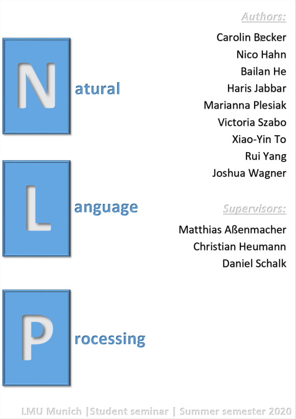

<!--- cover-image: images/cover.png -->

```{r setup, include=FALSE}
options(
  htmltools.dir.version = FALSE, formatR.indent = 2, width = 55, digits = 4
)
output <- knitr::opts_knit$get("rmarkdown.pandoc.to")
is.html = !is.null(output) && output == "html"

knitr::opts_chunk$set(fig.align="center")
if (output == "latex") { knitr::opts_chunk$set(out.width="\\textwidth") }
```

# Preface {-}


```{r cover, cache=FALSE, out.width="500", fig.align="center", echo=FALSE, eval = is.html}

```


In the last few years, there have been several breakthroughs concerning the methodologies used in Natural Language Processing (NLP). These breakthroughs originate from both new modeling frameworks as well as from improvements in the availability of computational and lexical resources.

In this seminar booklet, we are reviewing these frameworks starting with a methodology that can be seen as the beginning of modern NLP: _Word Embeddings_.

We will further discuss the integration of embeddings into end-to-end trainable approaches, namely convolutional and recurrent neural networks. 

The second chapter of this booklet is going to cover the impact of Attention-based models, since they are the foundation of most of the recent state-of-the-art architectures. Consequently, we will also spend a large part of this chapter on the use of transfer learning approaches in modern NLP.

To cap it all of, the last chapter will be abour pre-training resources and benchmark tasks/data sets for evaluating state-of-the-art models followed by an illustrative use case on Natural Language Generation.

This book is the outcome of the seminar "Modern Approaches in Natural Language Processing" which took place in the summer term 2020 at the Department of Statistics, LMU Munich.


This book is licensed under the [Creative Commons Attribution-NonCommercial-ShareAlike 4.0 International License](http://creativecommons.org/licenses/by-nc-sa/4.0/).


\mainmatter

# Foreword {-}

*Author: Matthias Aßenmacher*

<!-- An experiment -->
This book is the result of an experiment in university teaching. We were inspired by a group of other PhD Students around Christoph Molnar, who conducted another [seminar on Interpretable Machine Learning](https://compstat-lmu.github.io/iml_methods_limitations/) in this format.
Instead of letting every student work on a seminar paper, which more or less isolated from the other students, we wanted to foster collaboration between the students and enable them to produce a tangible outout (that isn't written to spend the rest of its time in (digital) drawers).
In the summer term 2020, some Statistics & Data Science Master students signed up for our seminar entitled "Modern Approaches in Natural Language Processing" and had (before kick-off meeting) no idea what they had signed up for: Having written an entire book by the end of the semester.

We were bound by the examination rules for conducting the seminar, but otherwise we could deviate from the traditional format.
We deviated in several ways:

1. Each student project is a chapter of this booklet, linked contentwise to other chapers since there's partly a large overlap between the topics.
1. We gave challenges to the students, instead of papers. The challenge was to investigate a specific impactful recent model or method from the field of NLP.
1. We designed the work to live beyond the seminar.
1. We emphasized collaboration. Students wrote the introduction to chapters in teams and reviewed each others individual texts.

<!-- Our experience -->
<!---
Looking back, the seminar was a lot of fun and -- from our perspective -- successful.
Especially considering that it was an experiment.
Everyone was highly motivated and we got great feedback from the students that they liked the format.
For the students it was a more work than a traditional seminar.
But in the end, our hope is that their effort will pay off for them as well, not only because of their increased visibility.
It was also more work for us supervisors.
But the extra effort was worth it, since limitations of interpretability are relevant for our research.
For me the seminar was an inspiration.
The students had new ideas and new perspectives to approach the limitations of interpretable machine learning.
-->

<!-- Technical setup -->
## Technical Setup {-}

The book chapters are written in the Markdown language.
The simulations, data examples and visualizations were created with R [@rlang].
To combine R-code and Markdown, we used rmarkdown.
The book was compiled with the bookdown package.
We collaborated using git and github.
For details, head over to the [book's repository](https://github.com/compstat-lmu/seminar_nlp_ss20).


