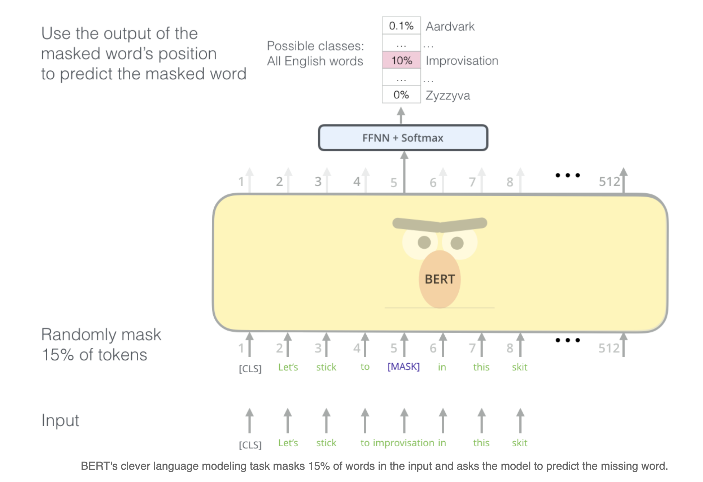
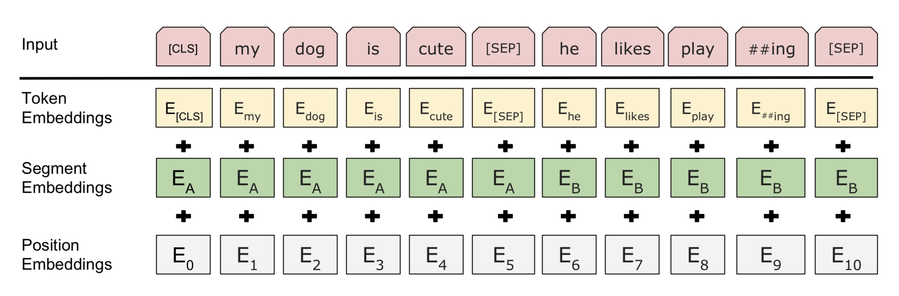
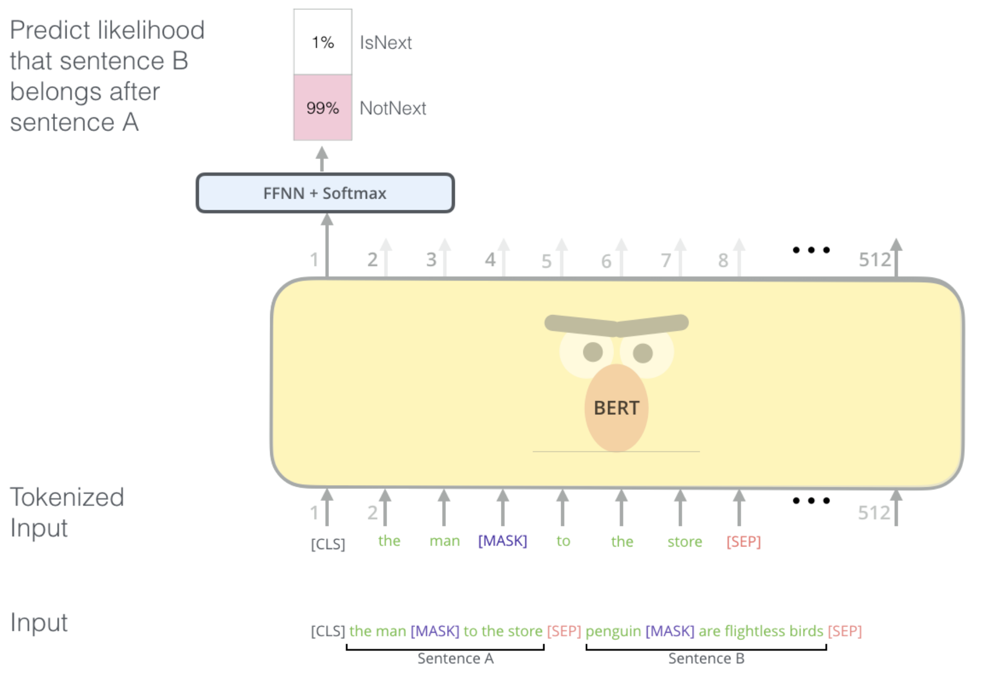
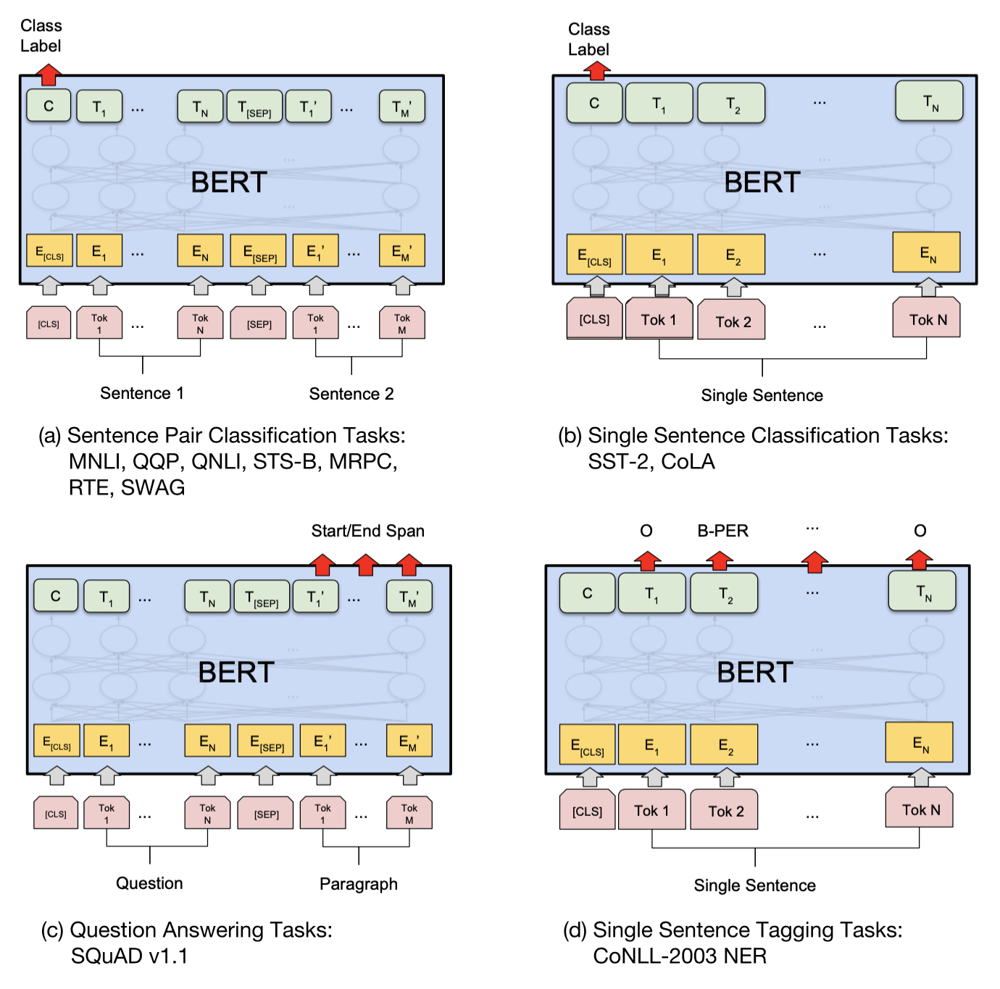

```{r setup2, include=FALSE}
knitr::opts_chunk$set(echo = FALSE)
```

## Content

1. Transfer Learning
1. (Self-)attention
1. Overview over important NLP models
1. BERT

## Transfer Learning

```{r figure01, echo=FALSE, out.width="80%", fig.cap="Traditional ML vs. Transfer Learning", fig.align="center"}
knitr::include_graphics("figures/02-00-transfer-learning-for-nlp/compare-classical-transferlearning-ml.PNG")
```


## Performance 

```{r figure01a, echo=FALSE, out.width="100%", fig.cap="", fig.align="center"}
knitr::include_graphics("figures/02-00-transfer-learning-for-nlp/ner_results.png")
```

Performance on Named Entity Recognition (NER) on CoNLL-2003 (English) over time.

## Attention

<div align="center">
<video width="800" height="450" controls>
  <source src="figures/02-00-transfer-learning-for-nlp/seq2seq_7.mp4" type="video/mp4">
</video>
</div>


## Transformers

```{r figure03, echo=FALSE, out.width="70%", fig.cap="Transformer, Alammar, Jay (2018). The Illustrated Transformer [Blog post]. Retrieved from https://jalammar.github.io/illustrated-transformer/", fig.align="center"}
knitr::include_graphics("figures/02-00-transfer-learning-for-nlp/The_transformer_encoders_decoders.png")
```

## Self-attention
```{r figure04, echo=FALSE, out.width="60%", fig.cap="Transformer translation, David Chenell for  Google AI Blog: Transformer: A Novel Neural Network Architecture for Language Understanding, Retrieved from https://ai.googleblog.com/2017/08/transformer-novel-neural-network.html", fig.align="center"}
knitr::include_graphics("figures/02-00-transfer-learning-for-nlp/transform20fps.gif")
```

## (Self-)attention

>- whole sequence input encoding, not sequential input encoding

>- less complex layers than CNNs

>- -> faster than both with better results

>- allows for training on even more data in reasonable time


## Overview over important NLP models

```{r figure05, echo=FALSE, out.width="70%", fig.cap="Transfer learning overview", fig.align="center"}
knitr::include_graphics("figures/02-00-transfer-learning-for-nlp/overview-tranferlearning.PNG")
```

## BERT

```{r figure06, echo=FALSE, out.width="70%", fig.cap="BERT structure, \n Alammar, Jay (2018). The Illustrated BERT, ELMo, and co. [Blog post]. Retrieved from http://jalammar.github.io/illustrated-bert/", fig.align="center"}

```


## GPT-2 

**GPT-2: A tremendous multilayer Transformer Decoder.**
```{r figure09, echo=FALSE, out.width="70%", fig.cap="BERT structure, \n Alammar, Jay (2019). The Illustrated GPT-2 [Blog post]. Retrieved from http://jalammar.github.io/illustrated-gpt2/", fig.align="center"}
knitr::include_graphics("figures/02-00-transfer-learning-for-nlp/gpt_2_decoder.png")
```


## XLNet

**XLNet**: Borrows ideas from autoregressive language modeling (e.g., Transformer-XL) and autoencoding (e.g., BERT) while avoiding their limitations.

## Discussion

**Thank you for your attention**


## BERT-Input Representation

```{r figure010, echo=FALSE, out.width="70%", fig.cap="BERT-Input Representation", fig.align="center"}

```

## BERT-Next Sentence Prediction(NSP)

```{r figure011, echo=FALSE, out.width="70%", fig.cap="BERT-Next Sentence Prediction(NSP), \n Alammar, Jay (2018). The Illustrated BERT, ELMo, and co. [Blog post]. Retrieved from http://jalammar.github.io/illustrated-bert/", fig.align="center"}

```


## BERT-4-Tasks 

```{r figure012, echo=FALSE, out.width="50%", fig.cap="BERT-4-Tasks", fig.align="center"}

```

## XLNet permutation language model

```{r figure013, echo=FALSE, out.width="60%", fig.cap="XLNet Permutation language model", fig.align= "center" }
knitr::include_graphics("figures/02-00-transfer-learning-for-nlp/xlnet-pml.png")
```

## Extra transformers 1

```{r figure_extra4, echo=FALSE, out.width="70%", fig.cap="Transformer example, Alammar, Jay (2018). The Illustrated Transformer [Blog post]. Retrieved from https://jalammar.github.io/illustrated-transformer/", fig.align="center"}
knitr::include_graphics("figures/02-00-transfer-learning-for-nlp/The_transformer_encoder_decoder_stack.png")
```

## Extra transformers 2

```{r figure_extra5, echo=FALSE, out.width="70%", fig.cap="Transformer architecture, Lilian Weng (2018). Attention? Attention!, Retrieved from http://lilianweng.github.io/lil-log/2018/06/24/attention-attention.html", fig.align="center"}
knitr::include_graphics("figures/02-00-transfer-learning-for-nlp/transformer.png")
```

## Extra transformers 3

```{r figure_extra6, echo=FALSE, out.width="70%", fig.cap="Transformer: Encoder-Decoder, Alammar, Jay (2018). The Illustrated Transformer [Blog post]. Retrieved from https://jalammar.github.io/illustrated-transformer/", fig.align="center"}
knitr::include_graphics("figures/02-00-transfer-learning-for-nlp/Transformer_decoder.png")
```
